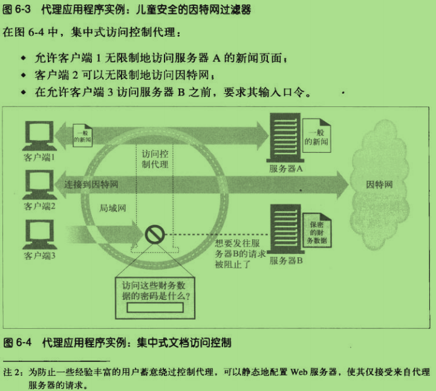
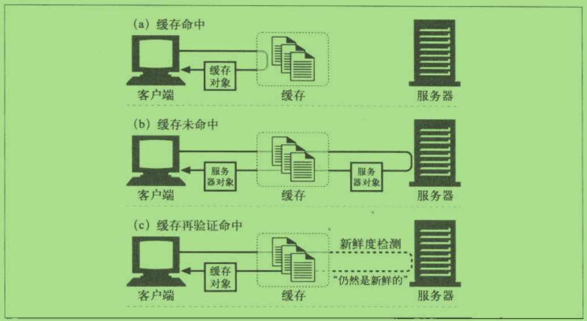
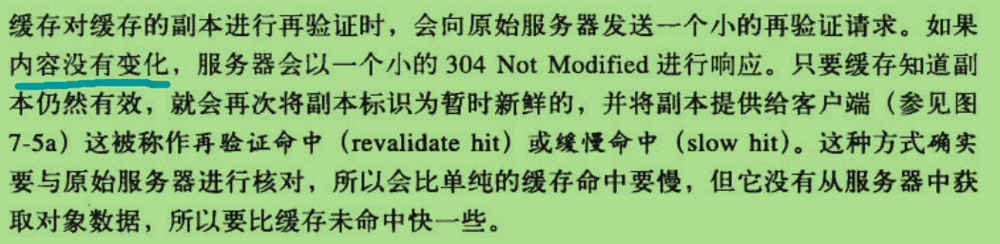

#第二部分 HTTP结构#

>- 第5章 Web服务器
>- 第6章 代理
>- 第7章 缓存
>- 第8章 网关、隧道、中继
>- 第9章 Web机器人
>- 第10章 HTTP-NG

##6.1.2 代理与网关的对比##

>- 代理连接的是两个或多个使用相同协议的应用程序，而网关则是两个或多个使用不同协议的端点。

##6.2 为什么要使用代理##

例：

>- 违禁内容过滤
>- 文档访问控制
     
 在集中式代理服务器上可以对所有访问控制功能进行配置，而无需在众多不同组织管理、不同厂商制造、使用不同模式的web
      服务器上，进行经常性的访问控制升级。
      

##7.5 缓存命中 和 缓存未命中的##

>- 可以用已有的副本为一些到达 缓存的请求提供服务，称为**缓存命中**(cache hit )
>- 其他一些到达缓存的请求会由于没有缓存的副本可用,而被转发给原始服务器,称为**缓存未命中** (cache miss)

##7.5.1 缓存 再验证##

>- 原始服务器的内容可能会发生变化，缓存要时不时对其进行检测，看看它们保存的副本是否仍然是服务器上的最新副本。
   这些"新鲜度检测" 称为HTTP再验证。
>- 为了有效地进行再验证，HTTP定义了一些特殊的请求，不用从服务器上获取整个对象，就可以检测出内容是否是最新的。

>- 缓存命中：客户端去拿缓存数据
>- 缓存未命中：客户端去拿原始服务器数据

>- 缓存对缓存的副本进行再验证的时候，会向原始服务器发送一个小的再验证请求。如果内容没有变化，服务器会以一个小的
   304 Not Modified 进行响应，只要缓存知道副本仍然有效，就会再次将副本标识为暂时新鲜的。并将副本提供给客户端，
   称为：再验证命中 或 缓慢命中。
>- 将 If-Modified-Since 首部添加到 GET 请求中去，就可以告诉服务器：只有在缓存了对象副本 并且 又对其进行了修改的
   情况下，才发送此对象
   
>-  
