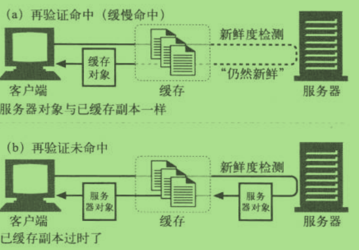
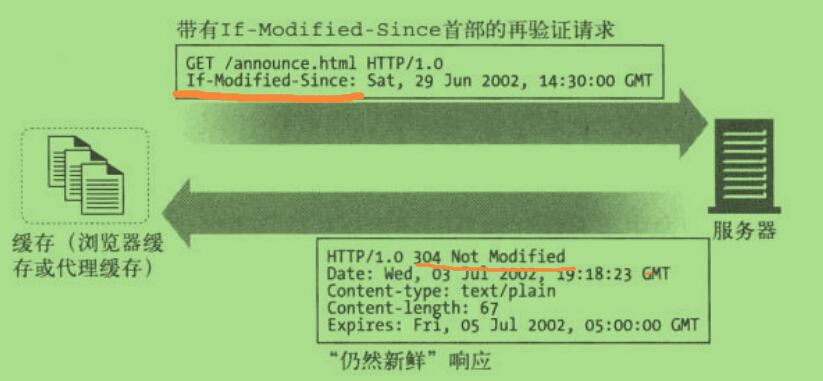
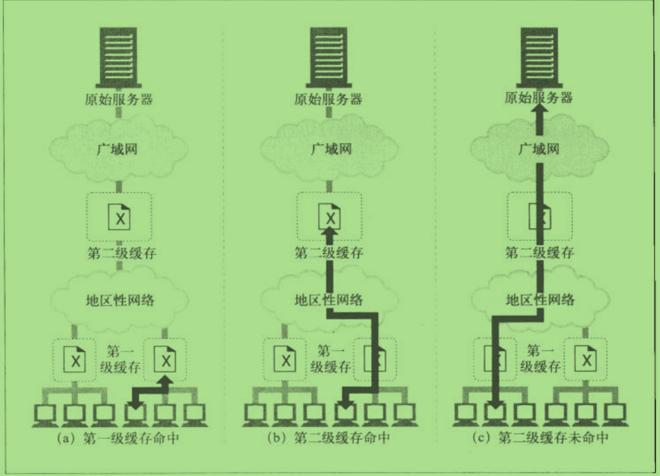
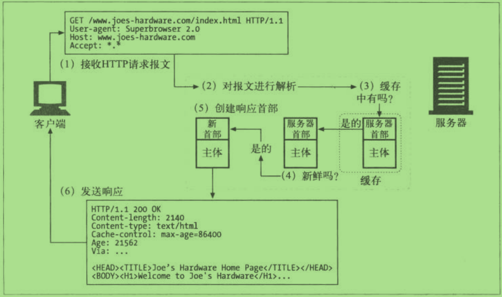

#第二部分 HTTP结构#

>- 第5章 Web服务器
>- 第6章 代理
>- 第7章 缓存
>- 第8章 网关、隧道、中继
>- 第9章 Web机器人
>- 第10章 HTTP-NG

##6.1.2 代理与网关的对比##

>- 代理连接的是两个或多个使用相同协议的应用程序，而网关则是两个或多个使用不同协议的端点。

##6.2 为什么要使用代理##

例：

>- 违禁内容过滤
>- 文档访问控制
     
 在集中式代理服务器上可以对所有访问控制功能进行配置，而无需在众多不同组织管理、不同厂商制造、使用不同模式的web
      服务器上，进行经常性的访问控制升级。
      

##7.5 缓存命中 和 缓存未命中的##

>- 可以用已有的副本为一些到达 缓存的请求提供服务，称为**缓存命中**(cache hit )
>- 其他一些到达缓存的请求会由于没有缓存的副本可用,而被转发给原始服务器,称为**缓存未命中** (cache miss)

##7.5.1 缓存 再验证##

>- 原始服务器的内容可能会发生变化，缓存要时不时对其进行检测，看看它们保存的副本是否仍然是服务器上的最新副本。
   这些"新鲜度检测" 称为HTTP再验证。
>- 为了有效地进行再验证，HTTP定义了一些特殊的请求，不用从服务器上获取整个对象，就可以检测出内容是否是最新的。

>- 缓存命中：客户端去拿缓存数据
>- 缓存未命中：客户端去拿原始服务器数据

>- 缓存对缓存的副本进行再验证的时候，会向原始服务器发送一个小的再验证请求。如果内容没有变化，服务器会以一个小的
   304 Not Modified 进行响应，只要缓存知道副本仍然有效，就会再次将副本标识为暂时新鲜的。并将副本提供给客户端，
   称为：再验证命中 或 缓慢命中。
>- 将 If-Modified-Since 首部添加到 GET 请求中去，就可以告诉服务器：只有在缓存了对象副本 并且 又对其进行了修改的
   情况下，才发送此对象。
   
这里列出在三种情况下：
> 1. 服务器的内容未被修改
> 2. 服务器的内容已被修改
> 3. 服务器上的对象被删除了
    
**服务器收到 GET If-Modified-Since 请求时会发生的情况：**

>- 再验证命中
    - 如果服务器对象未被修改，服务器会向客户端发送一个 304 Not Modified 响应。下图对此进行了描述！
>- 再验证未命中
    - 如果服务器对象与已缓存的副本不同，服务器向客户端发送一条带有完整内容的 HTTP 200 OK 响应
>- 对象被删除
    - 如果服务器对象被删除，服务器就回送一个 404 Not Found 响应，缓存也会将其副本删除
    

##7.6.3 代理缓存的层次结构##

>- 实现层次化的缓存还是很有意义的，在这种结构中，在较小的缓存中未命中的请求会被导向到较大的父缓存，
   由父缓存来为剩下的请求提供服务。
>- 下图的基本思想是： 在靠近客户端的地方使用小型廉价缓存，而更高层次中，则逐步使用更大、功能更强的缓存来装载多用户共享
   的文档
   
  

##7.7 缓存的处理步骤##

>- Web缓存的基本工作原理大多很简单，对一条HTTP GET 报文的基本缓存处理过程包括 7 个步骤：

> 1. 接收 —— 缓存从网络中读取抵达的请求报文。
> 2. 解析 —— 缓存对报文进行解析，提取出各种URL和首部。
> 3. 查询 —— 缓存查看是否有本地副本可用，如果没有，就向服务器获取一份副本(并保存在本地)。
> 4. 新鲜度检测 —— 缓存查看已缓存的副本是否足够新鲜，如果不是，就询问服务器是否有任何更新。
> 5. 创建响应 —— 缓存会用新的首部和已缓存主体来构建一条新的响应报文。
> 6. 发送 —— 缓存通过网络将响应发回给客户端。
> 7. 日志 —— 缓存可选地创建一个日志文件条目来描述这个事务。

