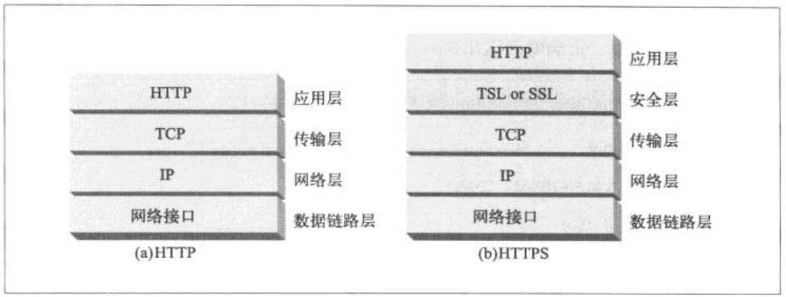
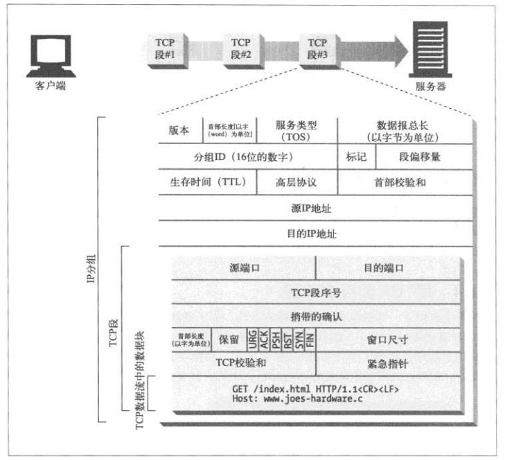
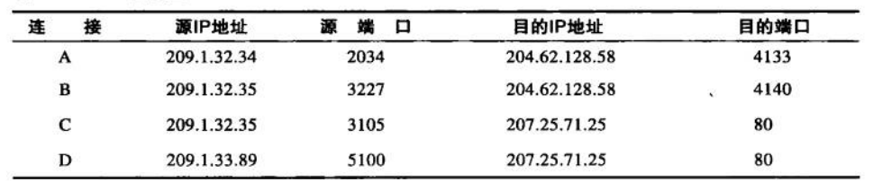
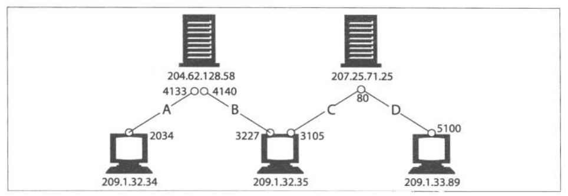
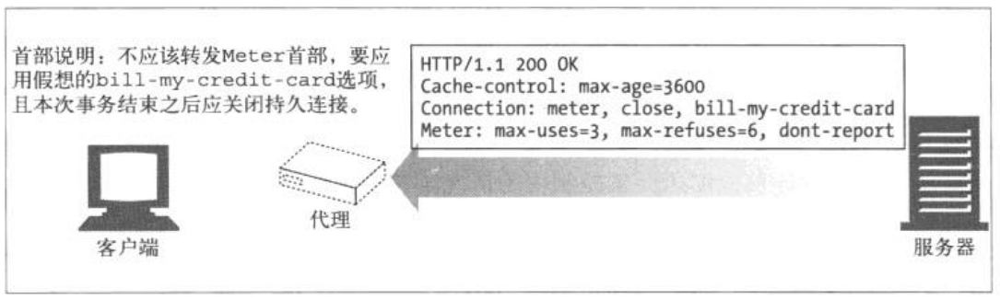

#### 《HTTP权威指南》 学习记录
 
**3.2.1 报文的语法**
>- 请求报文:

                <method> <request - URL> <version>
                <headers>
                
                <entity - body>

            
>- 响应报文:

                <version> <status> <reason - phrase>
                <headers>
                
                <entity - body>
                
 
 **4.1.1 TCP的可靠数据管道**
 
 
    HTTP连接实际上就是TCP连接和一些使用连接的规则。
    
    
 
**4.1.2 TCP流是分段的、由IP分组传送**

>- TCP的数据是通过名为IP分组 (或IP数据报) 的小数据块来发送的，按下图显示，HTTP就是 "HTTP over TCP over IP" 这个 
    "协议栈" 中的最顶层了。HTTP的安全版本HTTPS就是在 HTTP 和 TCP 之间插入了一个 (称为TLS 或 SSL) 的密码加密层。

 
**4.1.3 保持TCP连接的正确运行**

>- IP地址可以将你连接到正确的计算机，而端口号则可以将你连接到正确的应用程序上去。TCP连接是通过4个值来识别的：
                  < 源 IP 地址 、源端口号 |  目的 IP 地址 、 目的端口号 >
                  
>- 下图表示TCP连接当中的 IP分组(数据块) 中包含的参数、属性。
   
  
>- 在下图中，有4条连接：A、B、C、D 
  
  
  
  **注意**：有些连接共享了相同的目的端口号 ( C 和 D 都使用目的端口号80 )，有些连接使用了相同的源IP地址( B 和 C )，
        有些使用了相同的目的IP地址 (A、B、C、D) 。但没有两个不同连接的所有4个值都一样的。(因为两条相同的TCP连接
        不能拥有4个完全相同的地址组件值)
        
   
  
**4.3.1 常被误解的 connection 首部**
 
>- HTTP 的 Connection 首部字段中有一个由逗号分隔的<strong>连接标签列表</strong>，这些标签为此连接指定了一些不会，
   传播到其他连接中的去的选项，比如：可以用 connention ：close 来说明发送完下一条报文之后必须关闭的连接。
   
>- Connection 首部可以承载3种不同的类型标签：
  1.   HTTP首部字段名。
  2.   任意标签值，用于描述此连接的非标准选项。
  3.   值：close ， 说明操作完成后需关闭这条持久连接  
  
>- 如果连接标签中包含了一个HTTP首部字段的名称，那么这个首部字段就包含了与一些连接有关的信息，不能将其转发出去。
   在将报文转发出去之前，必须删除 Connection 首部列出的所有首部字段。
   
   
   
>- HTTP 应用程序收到一条带有 Connection 首部的报文时，接收端会解析发送端请求的所有选项，并将其应用，然后会在将此报文
   转发给一下条地址之前，删除 Connection 首部以及 Connection 中列出的所有首部。
    
    
    
    
    
    
  
    
    

