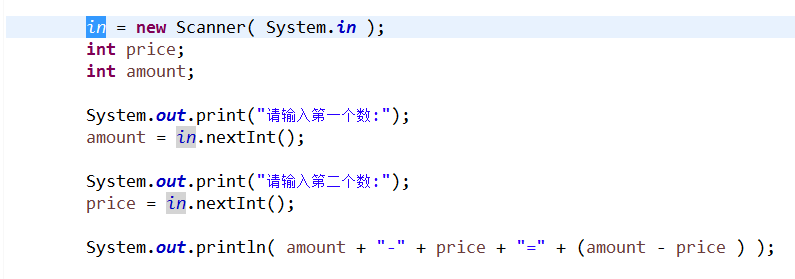
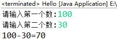
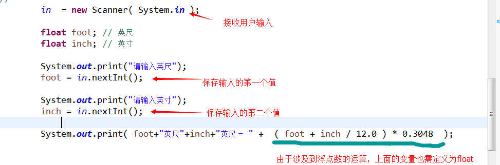
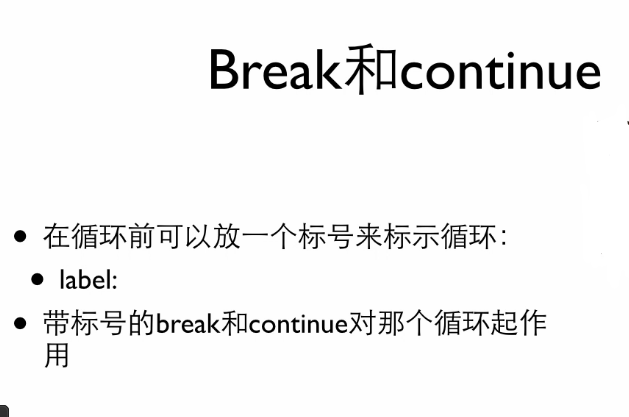
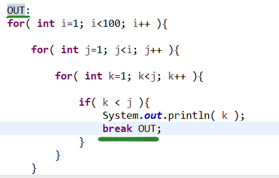

##Java学习记录##

######来自网易云课堂-Java######

######Start time: 2015 - 07 - 24######

###1.2.2 变量###

变量的定义形式：<类型名称> <变量名称>
>- int price;

例：

 

###1.2.4 浮点数###

 

>- 两个整数的运算的结果只能是整数

    System.out.print( 10 / 3 );  输出: 3  (因为两个都整数)
    
    System.out.print( 10.0 / 3.0 );  输出: 3.3333333333333
    
>- 实例:

    
    
##4.2.2 多重循环##

>- 普通的 break 在多重循环嵌套里, 只能退出一个循环, 但用 标示 可以指定 break 到哪里(标示名称自定义).

##5.1 数组##

>- Java 的数组中的所有元素只能具有相同的数据类型 (要么全是int, 要么全是string)
>- Java 的数组一旦创建，就不能改变大小`

