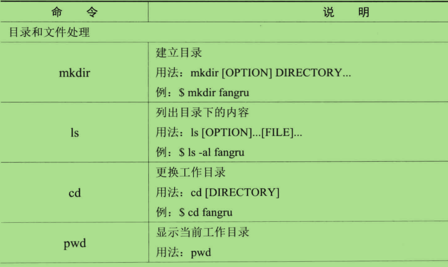

#第一章 第一次亲密接触#

##目录:##

1.1 让Linux入驻我们的电脑

1.2 不一样的图形操作
- 1.2.1 没有图形的图形
- 1.2.2 架构设计

1.3 主流桌面环境
- 1.3.1 KDE
- 1.3.2 GNOME
- 1.3.3 XFCE
- 1.3.4 LXDE

1.4 返璞归真的命令行
- 1.4.1 开始执行命令
- 1.4.1 文本和图形的切换
- 1.4.1 基础命令的操作
- 1.4.1 快捷键
- 1.4.1 错误信息
- 1.4.1 联机帮助
- 1.4.1 致命的Linux命令

1.5 结束语

##1.2.2 架构设计##

##1.4.3 基础命令操作##

