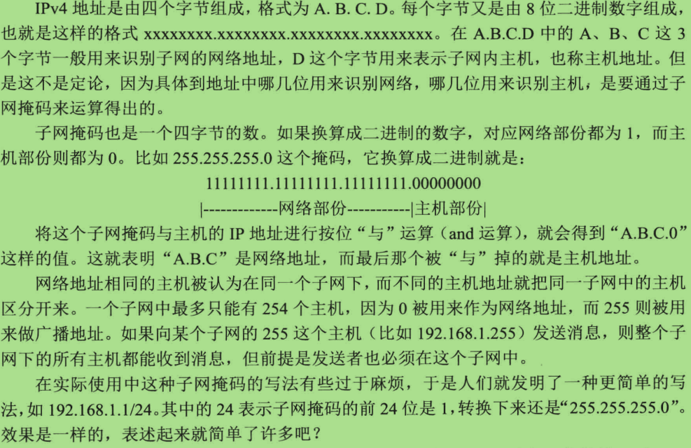
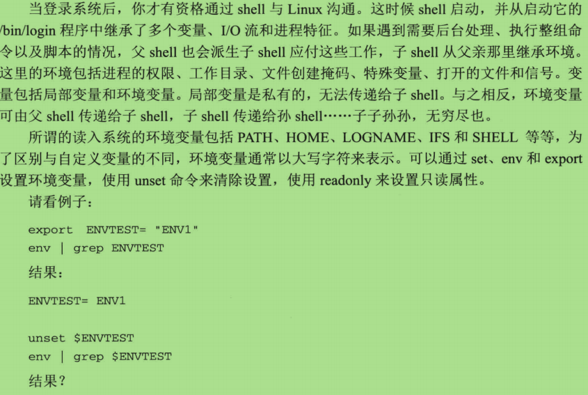
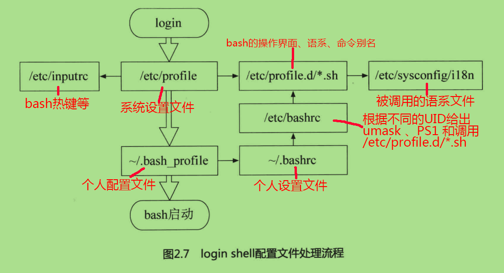
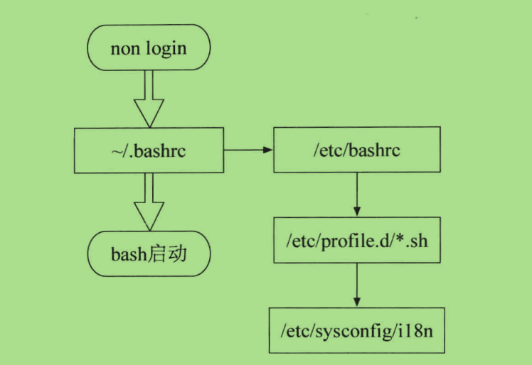
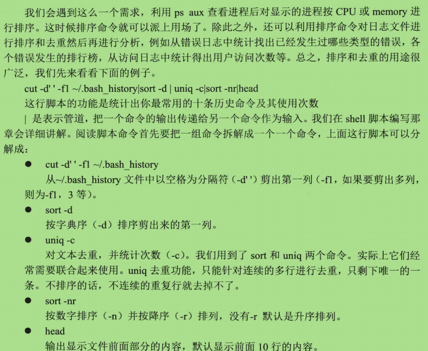

##为part2 的续版 完成 2.7  -  2.10 章节的记录##

##目录:##

####2.7 解决上网问题####

##2.7.1 了解IP地址##

>- IP 地址分为 IPv4 和 IPv6
>- IPv4
 

##2.8.2 环境变量##
>- 更多环境变量信息: <a href="http://www.cnblogs.com/growup/archive/2011/07/02/2096142.html" >linux 环境变量</a>
 
 

##2.8.3 bash配置文件##

在输入用户名和密码登陆之后 shell 才会启动，这是login shell。 
还有一种non-login shell ,不需要做重复的登录操作获取bash界面。

####1. 系统设置文件####
>- 只有 login shell 才会读取系统设置文件 /etc/profile ， 它是系统整体的配置文件，包含很多重要变量信息。每个用户登录后取得bash后一定会读取 /etc/profile 配置文件。

####2. 用户的个性设置文件####

>- login shell 读完 **/etc/profile** 配置文件后就读取用户的个人配置文件。
>- 个人配置文件主要有三个隐藏文件：
    - **~/.bash_profile**
        - 如果 **~/.bash_profile** 存在，bash就不会理睬剩下的两个文件
    - **~/.bash_login**
        - 如果 **~/.bash\_profile** 不存在，bash才会读取 **~/.bash\_login**
    - **~/.profile**
        - 如果前面两个文件都不存在，bash才会读取 **~/.profile**
>- 另外的几个用户个人文件：
    - **~/.bashrc**
        - 如果 ~/.bashrc 存在的话，~/.bash_profile还会调用它
    - **~/.bash_history**
        - 历史命令
    - **~/.bash_logout**
        - 此文件，可告诉系统在"我"离开之前要帮"我"做什么，如：备份等
        
        
####4. login shell 和 non login shell 整个配置文件处理流程图：####

##2.9.2 正则表达式##

>- 正则表达式是用来描述任意文本的一种特殊表达式,而且拥有两个基本要素：
    - 表达式 ε , 代表一个长度为0的文本，理解为 {NULL},通常将NULL记作ε     - 对字符集中的任意字符a, 仅有一个a字符，即 {a}
>- 以及三种基本运算规则：
    - 两个正则表达式的并，记作 X|Y, 例如：**a | b**  ==  **{a,b}**
    - 两个正则表达式的连接：
        - 记作XY , 将 X 文本中每个字符，连接上Y文本中的每个字符
        - 例如：**X** = a | b ,   **Y** = c | d  , 那么 XY = {ac,bc,ad,bd}
    - 一个正则表达式的克林闭包，记作 X* ，
        - 其实就是 a* ,  星号代表a后面任意跟字符
>- 扩展运算
    - [] 方块号。 例如：[a,b,c] ==  a | b | c  ==  [a-c]
        - 由于方括号中支持范围描述 "-", 如果要用 “-” 字段，则需要将他放在方括号的开头。例如： [-abc]
        - 在方括号中以 " ^ " 字符开头，表示在字符集中配出方括号中的所有字符之后，所剩的做并运算(另外一种用法是"^"没有在方括号里，表示匹配开头)，例如：[^ab] 则表示对除了ab以外的所有字符求并。
    - X? 表示 X|null , 代表只有 X 或 null 可选。要么X ,要么null
    - X+ 表示 X 至少要出现一次。
    
##2.9.3 搜索文本的 grep 命令##
>- grep 命令是一个使用正则表达式来检索文件内容的强大工具。
>- grep 学习连接：
    - <a href="http://www.cnblogs.com/end/archive/2012/02/21/2360965.htm" >Linux grep 命令</a>
    - <a href="http://www.cnblogs.com/ggjucheng/archive/2013/01/13/2856896.html" >Linux grep 命令详解</a>
    
    
##2.9.4 排序和去重复##

