#第二章 融于心而表于行#

##目录:##

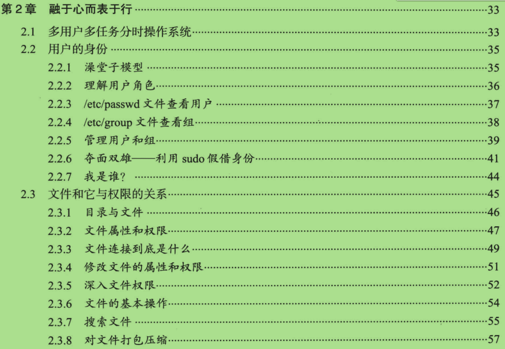
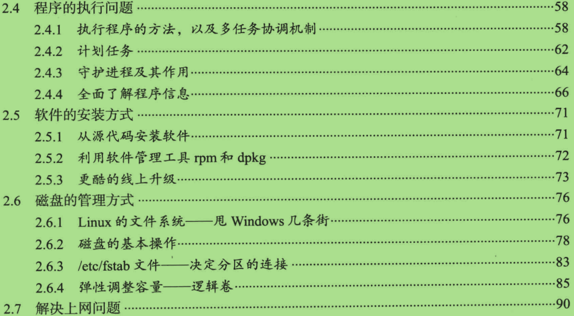
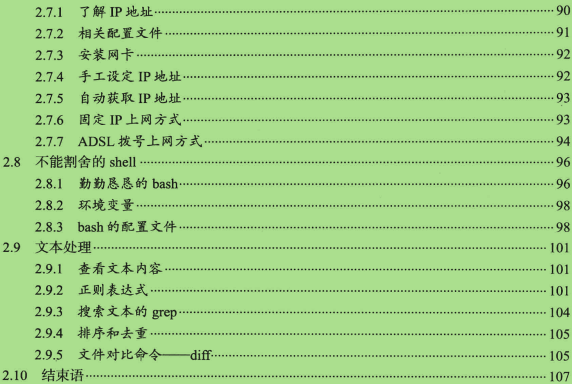

##2.2 用户的身份#

>- Linux 的用户等级只有两个：
    - root 用户
    - 非root 用户
    
>- Linux 中的用户组
    - 一个用户可以属于多个不同的用户组，注意：一个用户至少属于一个用户组
    - 用户组能够让很多用户同时给予文件访问的权限。
    - 能够同时管理许多用户
    

##2.2.3 /etc/passwd 文件查看用户##

>- 虽然说是用 /etc/passwd 查看用户，但那已是历史了，现在是查看 /etc/shadow .

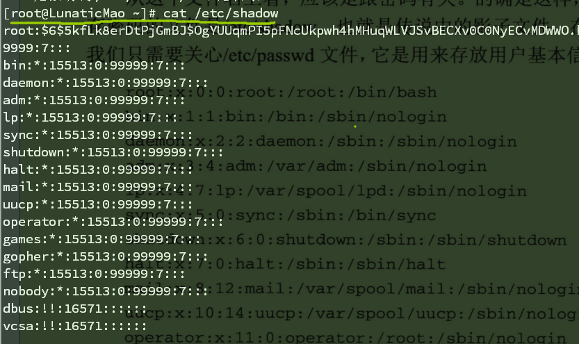

>- 文件里的每一行都代表了一个用户, 每一行由 ： 分割用7个字段：
    - 用户名 : 密码 : UID : GID: 用户全名: home目录 : shell 
    - UID (UserID) 、GID (GroupID) Linux 系统依靠这两值识别不同的用户和用户组
>- UID 和 GID:
    - 0 是 root 
    - 1 ~ 499 是 系统用户 (比如一些占坑的)
    - 500 ~ 4294967295 是 分配给普通用户 (创建的第一个用户, UID就是500)

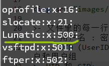
    
    
##2.2.4 /etc/group 文件查看组##

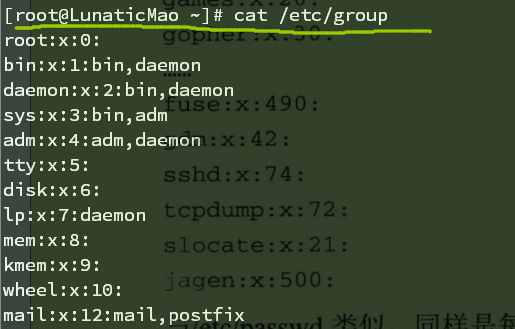

>- 与 /etc/passwd 类似，同样每行代表一个用户组，被：分割为4个字段。
    - 组名 : 用户组密码 : GID : 用户组内的用户名   
    
>- 多个用户可以有多个用户组
>- 在 /etc/passwd 文件里的GID 就代表着 "初始用户组" (只有一个GID)
>- 而那些有多个用户组叫 "支持用户组"    。
>- 使用groups 命令查看所有的 "支持用户组"

##2.2.5 管理用户 和 组##

**用户**
>- # useradd  用户添加
>- # userdel  用户删除
>- # usermod  用户修改

**用户组**

>- # groupadd
>- # groupdel
>- # groupmod

##2.2.6 夺面双雄- 利用sudo假借身份##

>- 在/etc/sudoers 文件中修改 sudo 的授权
>- 找到 root 的行 ，照着添加一个你要添加的用户

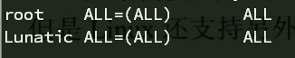

>- 但单个用户慢慢添加太麻烦， 可以对一个用户组进行 sudo　授权，那么这组用户组里的所有用户都会有sudo
    - %wheel   ALL=(ALL)   ALL              (对wheel用户组sudo授权,使用sudo时需要密码)
    - %wheel   ALL=(ALL)   NOPASSWD:ALL     (对wheel用户组sudo授权,使用sudo时不需要密码)

>- 在/etc/sudoers 文件授权给用户的时候还可以做一些限制：
    - 例如：限制users用户组只能操作这些文件夹
        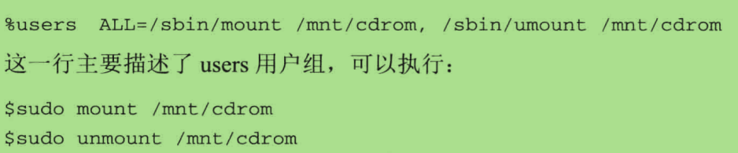
    - 例如：限制users用户组禁止操作某些文件夹(关键在于 ! ，表示禁止使用)
        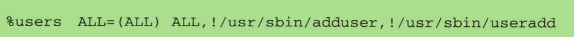
    - 另外值得一说的是：普通用户可以使用sudo 切换到 root 上，而且用的还是普通用户的密码
        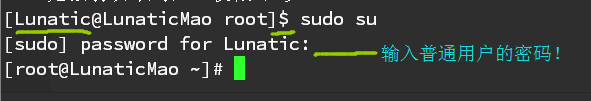
    - 原理是sudo命令就是 root 用户执行，那就代表 root 用户执行 su ,所以就不用 root 的密码。为了避免，应该在 /etc/sudoers 文件中禁止 su 被 sudo 特权执行
    - 禁止sudo su 在/etc/sudoers 里:   Lunatic ALL=(ALLALL) ALL,!/bin/su

##2.2.3 文件属性和权限#

>- linux 文件有三个固有属性：
    - 拥有者 (一般为创建这个文件的用户)
    - 所属用户组
    - 其他人
>- linux 文件有三个固有权利：
    - 读 、 写 、 执行

>- 文件结构：

    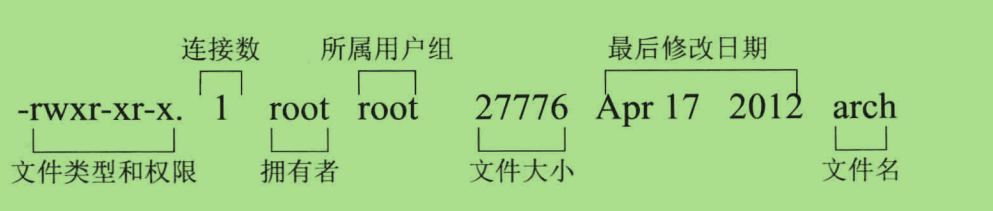
    
>- 文件权限结构：

    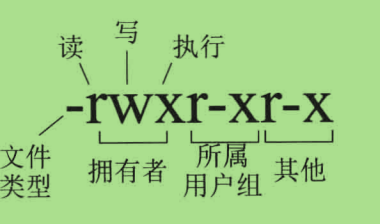
    
>- 文件类型：
    - 可以是：** -  、 d 、 l 、 b 、 c  、s 、 p **
    -  \- : 普通文件
    -  d  : 目录
    -  l  : 软连接 or 硬连接
    -  b  : 块设备，如磁盘等保存大数据的设备
    -  c  : 字符设备，如鼠标、键盘
    -  s  : 套接字文件
    -  p  : 管道文件

>- 隐藏文件 (可以通过ls -a 查看 ) 

    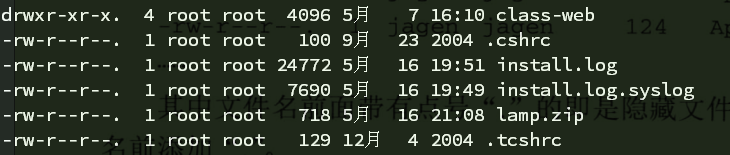
    
    - 文件名中前面有 . 的就是隐藏文件
    - 如果在创建文件时，文件名前加 . 也会变成隐藏文件
    
    
>- 文件的连接数 
    ****
    - 文件的连接数是什么？
    - 每创建一个文件的时候系统都会分配一个唯一的 inode，inode 是指向文件在磁盘中的物理位置，系统是通过 inode 定位文件的，而不是文件名。为了提高文件系统的执行效率，访问过的文件 inode 会被缓存在内存中，那么 文件 "连接数" 属性就是inode 的引用次数，为什么会有引用次数呢，原因在于 Linux 允许一个文件拥有多个名字。例：文件有4个连接数，代表有4个不同的文件名，链接到同一个文件上。
    - 连接又分为 "软连接" and "硬连接"
        - 软连接：也叫符号连接，其实并不是真正的连接，只是与windows中的快捷方式类似，但文件的连接数也不会增加！， 增加额外的 -s 选项创建软连接
            ****
            
        - 硬连接: 创建了硬连接的文件与目标文件的属性时完全相同的，因为引用的是相同的 inode， inode 也进行了 +1 , 创建硬连接则不用加 -s 选项，注意：硬连接要求与目标文件创建时要在同一个分区当中。
        
        
        
        
        
        
        
        
        

