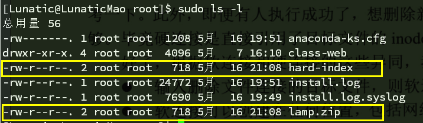
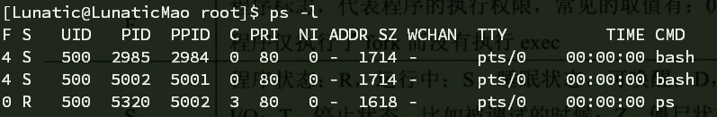
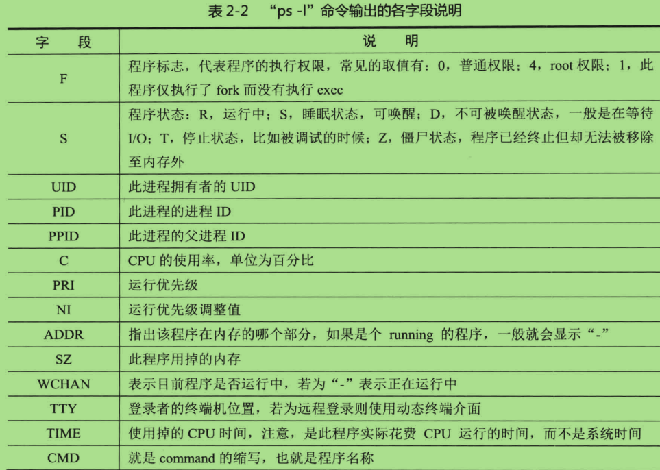
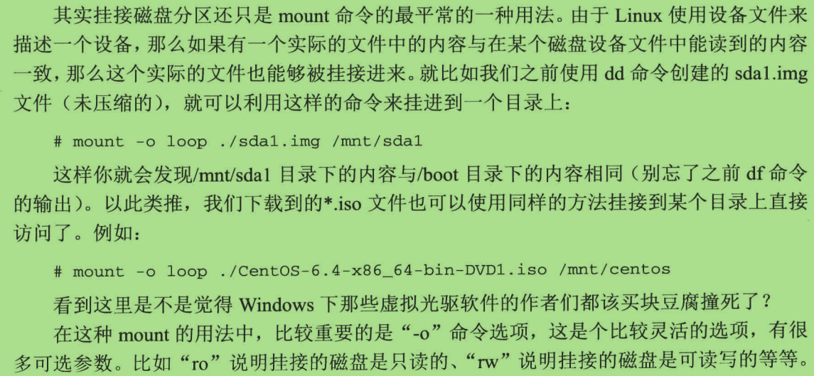

#第二章 融于心而表于行#

##目录:##

##2.2 用户的身份#

>- Linux 的用户等级只有两个：
    - root 用户
    - 非root 用户
    
>- Linux 中的用户组
    - 一个用户可以属于多个不同的用户组，注意：一个用户至少属于一个用户组
    - 用户组能够让很多用户同时给予文件访问的权限。
    - 能够同时管理许多用户
    

##2.2.3 /etc/passwd 文件查看用户##

>- 虽然说是用 /etc/passwd 查看用户，但那已是历史了，现在是查看 /etc/shadow .

>- 文件里的每一行都代表了一个用户, 每一行由 ： 分割用7个字段：
    - 用户名 : 密码 : UID : GID: 用户全名: home目录 : shell 
    - UID (UserID) 、GID (GroupID) Linux 系统依靠这两值识别不同的用户和用户组
>- UID 和 GID:
    - 0 是 root 
    - 1 ~ 499 是 系统用户 (比如一些占坑的)
    - 500 ~ 4294967295 是 分配给普通用户 (创建的第一个用户, UID就是500)

    
    
##2.2.4 /etc/group 文件查看组##

>- 与 /etc/passwd 类似，同样每行代表一个用户组，被：分割为4个字段。
    - 组名 : 用户组密码 : GID : 用户组内的用户名   
    
>- 多个用户可以有多个用户组
>- 在 /etc/passwd 文件里的GID 就代表着 "初始用户组" (只有一个GID)
>- 而那些有多个用户组叫 "支持用户组"    。
>- 使用groups 命令查看所有的 "支持用户组"

##2.2.5 管理用户 和 组##

**用户**
>- # useradd  用户添加
>- # userdel  用户删除
>- # usermod  用户修改

**用户组**

>- # groupadd
>- # groupdel
>- # groupmod

##2.2.6 夺面双雄- 利用sudo假借身份##

>- 在/etc/sudoers 文件中修改 sudo 的授权
>- 找到 root 的行 ，照着添加一个你要添加的用户

>- 但单个用户慢慢添加太麻烦， 可以对一个用户组进行 sudo　授权，那么这组用户组里的所有用户都会有sudo
    - %wheel   ALL=(ALL)   ALL              (对wheel用户组sudo授权,使用sudo时需要密码)
    - %wheel   ALL=(ALL)   NOPASSWD:ALL     (对wheel用户组sudo授权,使用sudo时不需要密码)

>- 在/etc/sudoers 文件授权给用户的时候还可以做一些限制：
    - 例如：限制users用户组只能操作这些文件夹
        
    - 例如：限制users用户组禁止操作某些文件夹(关键在于 ! ，表示禁止使用)
        
    - 另外值得一说的是：普通用户可以使用sudo 切换到 root 上，而且用的还是普通用户的密码
        
    - 原理是sudo命令就是 root 用户执行，那就代表 root 用户执行 su ,所以就不用 root 的密码。为了避免，应该在 /etc/sudoers 文件中禁止 su 被 sudo 特权执行
    - 禁止sudo su 在/etc/sudoers 里:   Lunatic ALL=(ALLALL) ALL,!/bin/su

##2.3.2 文件属性和权限#

>- linux 文件有三个固有属性：
    - 拥有者 (一般为创建这个文件的用户)
    - 所属用户组
    - 其他人
>- linux 文件有三个固有权利：
    - 读 、 写 、 执行

>- 文件结构：
     
    
    
>- 文件权限结构：
     
    
    
>- 文件类型：
    - 可以是：** -  、 d 、 l 、 b 、 c  、s 、 p **
    -  \- : 普通文件
    -  d  : 目录
    -  l  : 软连接 or 硬连接
    -  b  : 块设备，如磁盘等保存大数据的设备
    -  c  : 字符设备，如鼠标、键盘
    -  s  : 套接字文件
    -  p  : 管道文件

>- 隐藏文件 (可以通过ls -a 查看 ) 
     
    
    - 文件名中前面有 . 的就是隐藏文件
    - 如果在创建文件时，文件名前加 . 也会变成隐藏文件
    
    
>- 文件的连接数 
     
    
    - 文件的连接数是什么？
    - 每创建一个文件的时候系统都会分配一个唯一的 inode，inode 是指向文件在磁盘中的物理位置，系统是通过 inode 定位文件的，而不是文件名。为了提高文件系统的执行效率，访问过的文件 inode 会被缓存在内存中，那么 文件 "连接数" 属性就是inode 的引用次数，为什么会有引用次数呢，原因在于 Linux 允许一个文件拥有多个名字。例：文件有4个连接数，代表有4个不同的文件名，链接到同一个文件上。
    - 连接又分为 "软连接" and "硬连接"
        - **软连接**：也叫符号连接，其实并不是真正的连接，只是与windows中的快捷方式类似，但文件的连接数也不会增加！， 增加额外的 -s 选项创建软连接
         
        
        - **硬连接**: 创建了硬连接的文件与目标文件的属性时完全相同的，因为引用的是相同的 inode， inode 也进行了 +1 , 创建硬连接则不用加 -s 选项，注意：硬连接要求与目标文件创建时要在同一个分区当中。
         
        
        
        
        
        
##2.3.5 深入文件权限##

>- linux 内的文件权限还不止 r w x 这三个，还包括  s 和 t，他们与系统账号 和 系统进程有关
>- 文件权限 **s** : 这个标记可以出现在文件拥有者的 x 权限位上，也可以出现在所属组的权限 x 位上。前者称为 SUID 后者 SGID
    - SUID : 指的是当一个文件的拥有者权限 : -rws rw- r 中的 x 位变成 s ，就表明任何执行这一个文件的普通用户，都会有这个文件拥有者的权限。
    - 例如：su 命令，
     
    
    - su 命令(linux中所有东西都是文件夹) 的拥有者的权限是 r w s , su命令文件夹的拥有者是root ,  那么因为权限是 rws，su命令就设置了SUID ，普通用户在执行 su 命令时，就会拥有了 root 的权限了(如果文件拥有者是mao, 那么就会有 mao 的权限)，这个权限仅在执行 su 命令是有效，这也是su 命令能够切换用户的原理。
    - **简略说SUID就是设置拥有创建文件的用户的身份的其他用户身份，意思是你和创建文件的所有者一样的身份权限**
    - <a href="http://zhidao.baidu.com/link?url=FHB-XvoWgTD5D3JRXH16cDCsuZDo8sSo1bkLuna1zEDCY73VgpVhpTXAMhmpsMJHBWL4vE543QESDrb4ZLJmy_" >什么是SUID？</a>

>- 文件权限 t 
    - 这个权限是应用在文件限组中的 "其他人" 中：
        - -rw- rw- r-T  设置了t （Sticky Bit）简称SBIT。
        - 在 "其他人" 权限中有了T， 代表除了 文件拥有者 和 root 外其他人都不得删除此文件
        - SBIT 典型应用在 tmp 目录，这个目录允许任何用户在内创建文件夹，设置了 SBIT 后，就只有自己和root能删除此文件夹
        
>- 这类权限也可用数字法表示，就是将 原来的 3位数字 扩展成4位
    - chmod 7777 ....
    
    
    
##2.3.7 搜索文件#

>- Linux有5个搜索文件的命令: whereis \ locate \ which \ type \ find
    - **$ whereis ls**
        - 搜索ls命令的文件所在位置，快速，是因为whereis 搜索不是在磁盘中漫无目的的查找，而是在数据库中(/var/lib/mlocate/)中查询, 这个数据库里包含了本地文件的所有信息，并且每天自动执行 updatedb 命令更新一次。但这样刚刚创建的文件就搜索不了，要更新的话就手动执行updatedb命令
         
    - **$ locate ls**
        - 搜索数据库(/var/lib/mlocate/)中的路径出现过 ls的路径，类似于 通配符 \*ls\*  ，不管前面后面只要出现了ls 就会被匹配到
         
    - **$ which apache**
        - which 搜索命令会在 $PATH 环境变量中指定的路径来搜索可执行文件的所在位置。一般用来确认系统中是否安装了某些软件。比如是否安装了apache
         
    - **$ type -p 文件名**
        - $ type -p 文件名 等同于 $ which 文件名
         
    - **$ find**
        - <a href="http://geekmao1997.blog.163.com/blog/static/2469330582015780534761/">find 命令详解</a>
        
        
##2.3.8 压缩文件#

>- 压缩类型：tar.gz  /  tar.bz2  /  tar.xz
>- 压缩比例：gz  >  bz2  >  xz
>- 压缩速度：xz  >  bz2  >  gz
>- tar 命令详解：<a href="http://www.cnblogs.com/li-hao/archive/2011/10/03/2198480.html" target=_blank>tar 命令详解</a>

>- 压缩：
    - z 代表 gz , j 代表 bz2 ,  J 代表 xz
    - FILES 代表要被压缩的文件、目录
    - 例：**# tar -zcvf filename.tar.gz FILES**
    - 例：**# tar -Jcvf filename.tar.xz FILES**
    

>- 解压：
    - **$ tar -vx -f filename.tar**
    - 或
    - **$ tar -vxf filename.tar**
    - 注意：选项 **f** 代表：使用档名，**f** 后不可再有其他除档名外的东西  
     
>- 其他：比tar压缩更好的压缩：<a href="http://www.cnitblog.com/flutist1225/articles/18974.html"  target=_blank>cpio 命令详解</a>

        

##2.4.1 执行程序方法，以及多任务协调机制##

>- cpio: 
    - **# find /boot | cpio -ocB > /tmp/boot.img**
    - 找出boot文件下的所有文件,通过管道符 " | ",传给cpio, cpio再打包到 tmp/boot.img
    
>- 解读管道符 " | "  
    - 将左侧的 输出 传到 右侧。
    
>- 重定向" > "
    - 将cpio打包好的文件 重定向到 另外的文件中
>- 详细重定向内容: <a href="http://blog.sina.com.cn/s/blog_8a18c33d01012jrd.html" target=__blank>Linux重定向操作符</a>

###后台任务##

>- 创建后台任务: 
    - **# ls &**   (在后面加上 & 就放在后台了)
        - 添加了一个 ls 命令在后台，不过由于执行ls命令很快，你刚按回车系统就提示你，已经完成了
         
        
        - **# tail -f index.php** 加了 -f 选项循环执行
        - 使用 jobs 命令查看留在后台的程序

>- 把后台任务切换到前台：
     
    
    - 每条任务最前面有个任务号，可以用 **# fg 1** , 把任务号为[1]的后台任务切换到前台
    - 每天任务前有 "+" : 表示这条任务是默认任务，使用**# fg** 不加参数，就把默认的后台任务切换到前台

>- 杀死后台任务
    - **#  kill -15 %2**  把任务号为 [2] 的任务杀死
     
    
    - **kill** 命令原理 ：**kill** 命令是传递信号给具体的任务或进程 ，
                    **-15** 就是一个信号，<a href="http://blog.csdn.net/wesleyluo/article/details/5279482" targer=__blank>linux signal 列表</a>        
    - **%2** ： 实际上是传递一个数字的进程ID, 但是这与任务号有冲突，所以要加上 **%**  来区分
    
>- 即使退出终端，任务也不会退出
    - 平常的退出Linux，后台任务自然就跟着显示了，但可以用下面
    - **# nohup [命令及参数] &**
    
##2.4.2 计划任务##

>- 计划任务分为：**一次性**  和  **周期性**  两种
    - **一次性**：
        - 1. \# at s10:00 tomorrow
        - 2.  at> /bin/echo "明天10点定时执行程序"
        - **解读**：输入了**at**命令后，提示符会变为 **at>** ，让你输入要执行的程序段，如果用到了命令，例如：**echo** , 要写为 **/bin/echo "abc"** , 因为在计划性任务中$PATH环境变量会出问题，所以要把全路径加上。
    - **周期性**：
        - 周期性任务 cron
            - **# crontab -e**  编辑当前用户的cron表
            - **# crontab -l**  查看当前用户的cron表
            - **# crontab -r**  删除当前用户的cron进程
            - **# crontab -u 用户名**      以某用户身份来控制cron表        
        - 添加周期性任务：(**# crontab -e**)
            - 格式: **分钟 小时 日 月 周  [用户名]  命令**
        
        
        - 周期性任务的时间符号
            <table style="text-align:center;">
                <tr>
                    <th>符号</th>
                    <th>含义</th>
                </tr>
                <tr>
                    <td>*</td>
                    <td>代表任意时间</td>
                </tr>
                <tr>
                    <td>,</td>
                    <td>
                    代表分割出不连续的时间,比如 2,3 表示2和3都行 
                    </td>
                </tr>
                <tr>
                    <td>-</td>
                    <td>代表连续的时间段,比如2-4 表示2、3、4</td>
                </tr>
                <tr>
                    <td>\*/n</td>
                    <td>代表每隔单位时间</td>
                </tr>   
            </table>
    
##2.4.3 守护进程及其作用##
>- 了解到用户请求系统服务之后，系统的进程工作流程

##2.4.4 全面了解程序信息##
>- 使用 **ps \ top \ pstree** 三个命令了解当前系统中运行着哪些程序、都使用了哪些资源以及程序之间的关系是什么。
	- **# ps aux** 查看系统中所有程序数据
	- **# ps ux** 查看当前用户的所有程序数据
	- **# ps -l** 查看与当前终端关联的程序数据
 
>- 执行 **# ps -l** 命令
     
	
	
	 
>- 执行 **# ps aux**  命令
	- 如果其中 COMMAND显示命令栏太长， 使用 **# ps aux | more**
	 
	
	
	 
>- 执行 **# top** 命令
     
	
	
>- CPU占比 、 平均工作负载
     
    
>- 执行 **# pstree** 命令
     
	

##2.5.2 利用软件管理工具 rpm和dpkg##
>- Linux上最通用的两个软件管理工具
 

##2.5.3 线上升级##
>- Linux上最流行的两个线上升级工具

##2.6.1 Linux的文件系统##

>- **FAT32**
	- 是Windows95时代的文件系统，我的u盘也还是FAT32的。
	- FAT32 (File Allocation Table) 类似于表格一样的文件系统，由于其描述文件大小的属性是一个32位的值，导致FAT32能支持的单个文件最大不能超过4G。
>- **NTFS**
	- 是微软为了 NT系统而设计的，单个文件最大可以到2T, XP \  Win7 都是NTFS，
>- **ExtN (N=2,3,4)**
	- ExtN是linux的文件系统，此文件系统被称为“索引式文件系统”
>- FAT32 与 ExtN 文件系统相比较：
	- **ExtN** 通过inode能够一次性获得文件数据所存放的位置，可以来安排磁盘的阅读顺序，尽量保证在磁盘只转一圈的情况下将所有内容读出来。
	- **FAT32** 只有将对应的date block读入之后才知道下一个data block的位置，如果一个文件的data block位置比较分散的话，有时候要转很多圈才能读完数据。这就是windows用长时间对文件进行创建、删除、读写就很难保证同一个文件的data block的位置是相邻的，而由于FAT32的特性，在data block位置不相邻的情况下，读写性能会急剧下降，所以，为了提交FAT32的性能，经常做“磁盘碎片管理” 是很有必要的。
	 

    
    
    
##2.6.2 磁盘的基本操作##
>- 在前面我们学习到了文件的基本操作：**ls  cd  cp  rm  vm**
	- 虽然这些操作都是作用在磁盘中，但他们面向的对象要高级一些，属于文件的范畴。
>- 接下来要学的则是稍微低级一些，面对的是文件的载体，磁盘的基本操作：
	- 常用的命令 : **df   du   dd   fsck  mount**
	- **# df**
		- **df** 命令是通过读取super block实现的
		 
		
	- Windows中每一个分区都有盘符与它对应( C:/D:/....)  , 分区可以看做一棵树，树根就是某个 C盘或其他。Linux的组织文件和目录的方式也能看成是一棵树，但由于Linux没有C盘D盘概念，于是就特意规定了一个总的树根叫 **"/"** ， 而具体某个分区的树根就从某个目录开始，至于不同的分区应该从哪个目录开始这个就没有明确的规定，即你可以随意指派。而具体指派哪个 **分区** 与哪个 **目录** 对应，就要用**mount**命令了
	- 在上图中的 **/dev/sda1 、 /dev/sda2 、 /dev/sda3** , 其中的 **sda** 是磁盘的分区设备名，在linux系统中 **/dev** 目录下的所有文件都与一个具体的设备有关，有物理的，也有虚拟的
		- 而 **sda1** 就是一个物理设备，对应系统第一块串口硬盘的第一个分区
		- **sda2** 对应系统第一块串口硬盘的第二个分区
		- **sdb1** 对应系统第二块串口硬盘的第一个分区
	- **# du**
		- df命令是读取super block 效率很高，但du命令是读取所有的inode来计算局部数据, 效率比较低
	- **# dd**
		- 格式: **\# dd  if=input_file  of=out_file**
		- 其实，**"if"**  **"of"** 这个两个参数不用给定，会有默认值，**"if"** 的默认值是标准输入， **"of"** 的默认值是标准输出
		- **dd** 命令去模拟 **cat** 命令
		    - **# dd if=1.txt**
		- 前面讲过，具体的硬件设备会在/dev目录下由具体的文件相对应，例如/dev/sda1。如果要制作第一个串口磁盘的第一个分区的镜像文件：
		    - **# dd  if=/dev/sda1  of=./sda1.io**
		    - 加上压缩
		    - **# dd if=/dev/sda | gzip -9 > ./sda1.io**
	    - dd 命令还能使用 bs 和 count 两个参数，能够指定依次读写的字节数和读写次数
	        - 比如我要备份磁盘的主引导记录：
	            - # dd if=/dev/sda of=./mbr.img bs=512 count=1
	            - 要求只读取sda磁盘的首个512字节信息，也就是第一个扇区的内容。
	             

    - **# fsck**
        - fsck对文件系统的损坏进行修复，对磁盘的损坏就没有办法修复的。
        - 格式 : **# fsck -t 文件系统 设备名**
        - **# fsck -f -t Ext3 /dev/sda1**
    - **# mount**
        - 格式: **# mount [-t 文件系统] 设备名称 挂接点**
        - [linux mount 命令详解][1]
         

