#第三章 一棵“树”的奥秘#

##目录：##
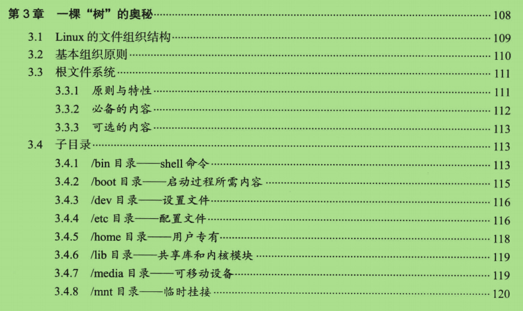
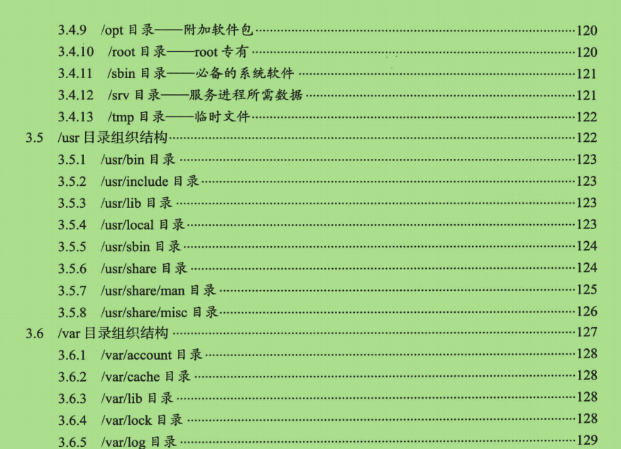
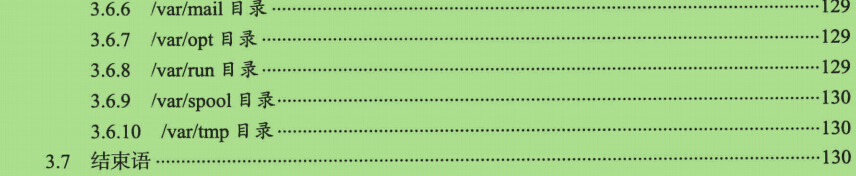

##3.3.2 必备的内容##
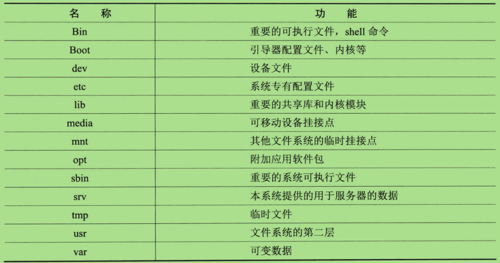

##3.4.1 /bin 目录 —— shell命令##

>- /bin 目录下包含了用户命令文件，也就是shell命令。
####1. 必备内容####
>- /bin 目录下的必备内容
 
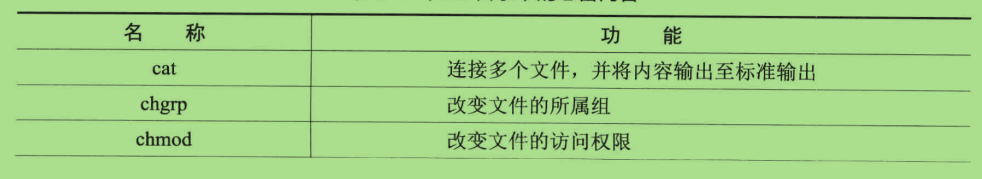
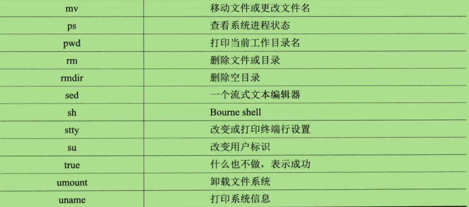    

####2. 可选内容####
>- /bin 目录下的可选内容
 
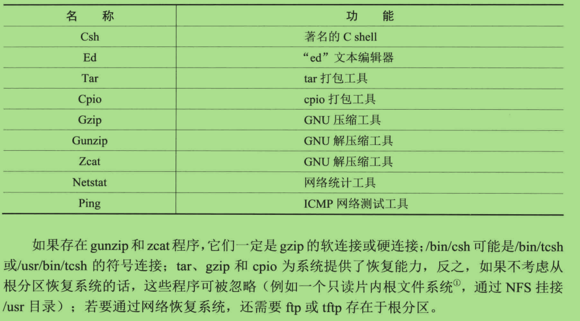    

##3.5.4 /usr/local目录##

>- /usr/local/ 目录整个文件系统的第三个主要区段，是供系统管理员安装局域性软件使用的。它保证在了当系统更新时不会把他们覆盖掉，所以一般是挂接到一个独立的磁盘分区上的。
 
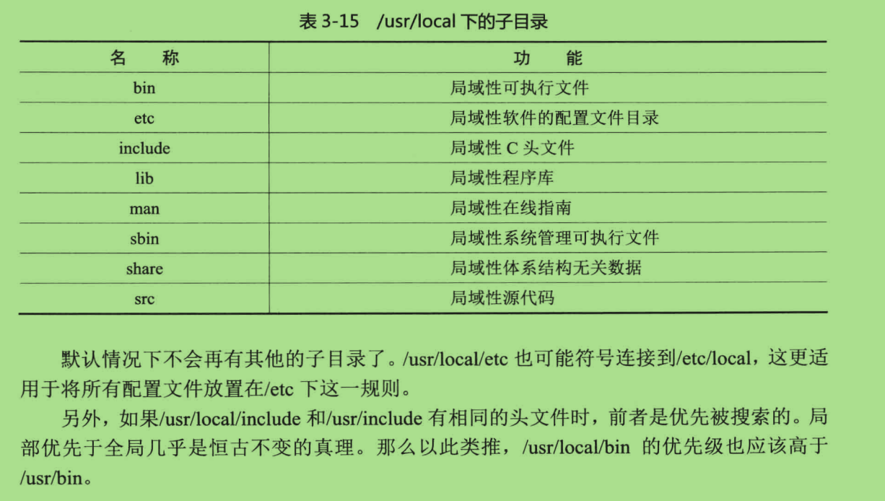

 ##3.6 /var 目录组织结构##
 
 >- /var 目录包含着系统中绝大多数的随时变化着的数据，比如系统日志。
  
 
 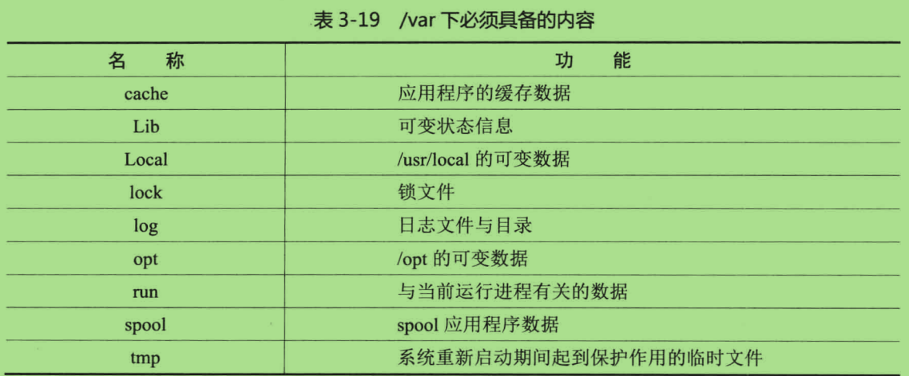
 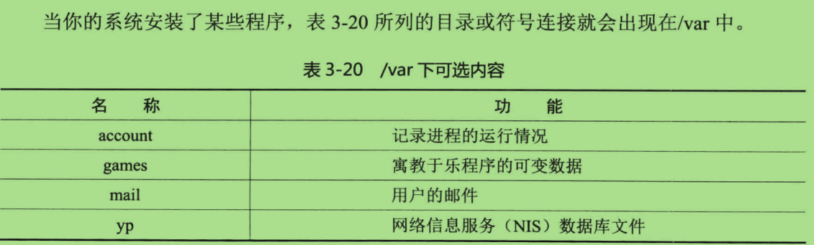
 
 ##3.7 结束语##
  
 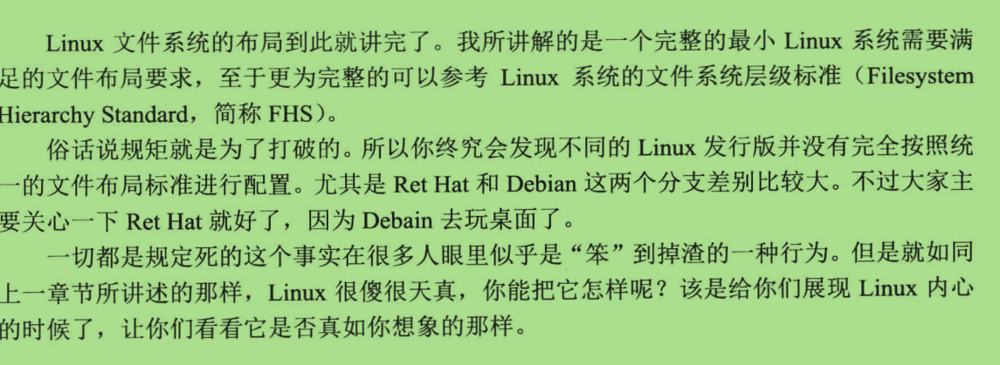
 
