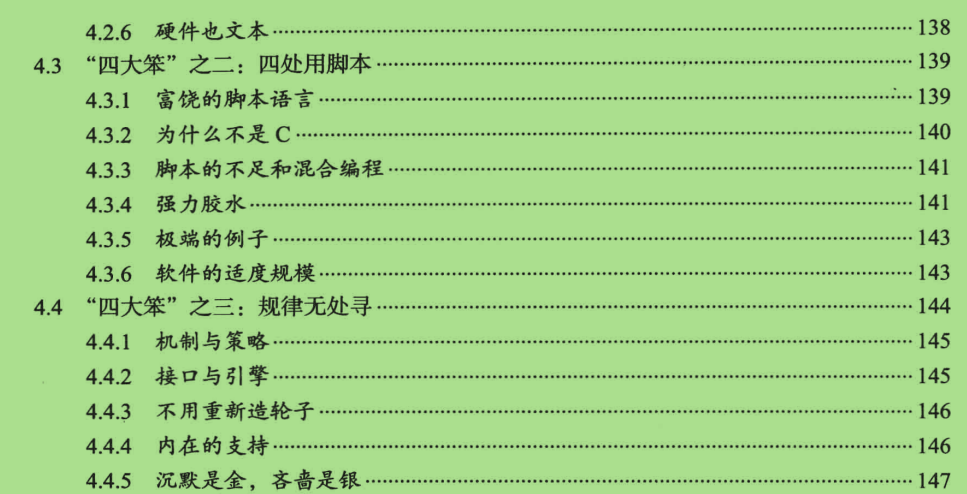

#第四章 “笨”出来的文化和哲学#

##目录：##

##4.5.5 命令行选项##

>- 有三种约定可以区分命令行选项和普通参数：
    - 原始Unix风格
        - 以连字符 " - " 开头的单个字符。如果选项后面不带参数，则被称之为模式选项。  模式选项是可以组合在一起使用的，例如： -a -b 是模式选项，那么 -ab -ba都正确
    - GNU风格
        - 使用连续的两个连字符 " -- " 后接选项关键字
    - X tookit风格
        - 最好别用
###下图给出Unix风格选项的含义###
 

