#第五章 shell 脚本编程#

##目录：##
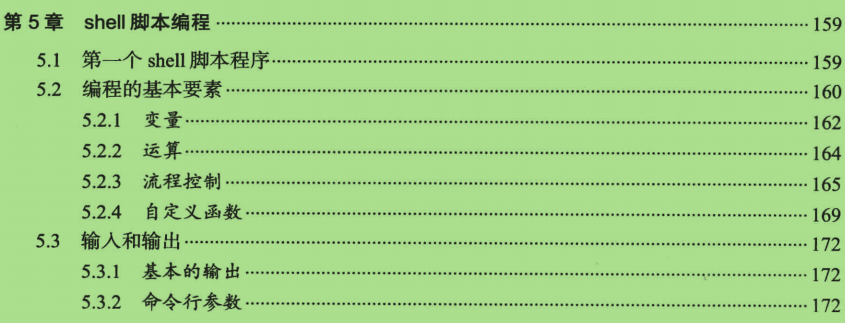
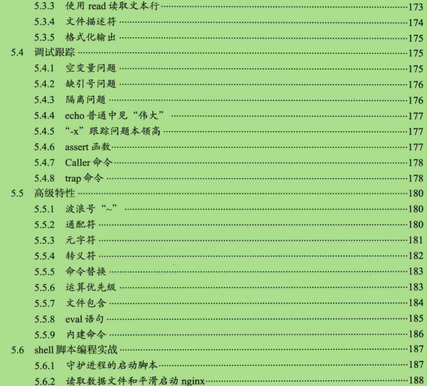 

##5.1 第一个 Shell 程序##
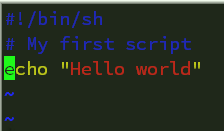
>- 脚本程序必须以 " **#!/xxx/xxxx** "  开始
    - **#!** 符号是脚本解释程序的声明指令，由调用这个脚本的shell来检测，这个命令指令仅仅在第一行有效，在例子中：我们用 **/bin/sh** 来执行程序
    - **#** 符号 就是程序的注释了
    - **# bash filename** 来运行脚本程序
    
##5.2.1 变量##
>- **mao=abc** 声明变量赋值，**=** 等号两边不能有空格
>- **echo \$mao** 输出变量， 要在变量前加个 **$**

##5.2.2 运算##
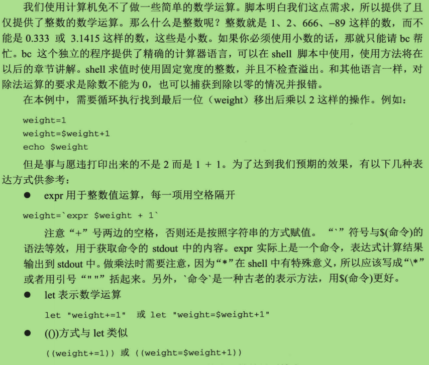
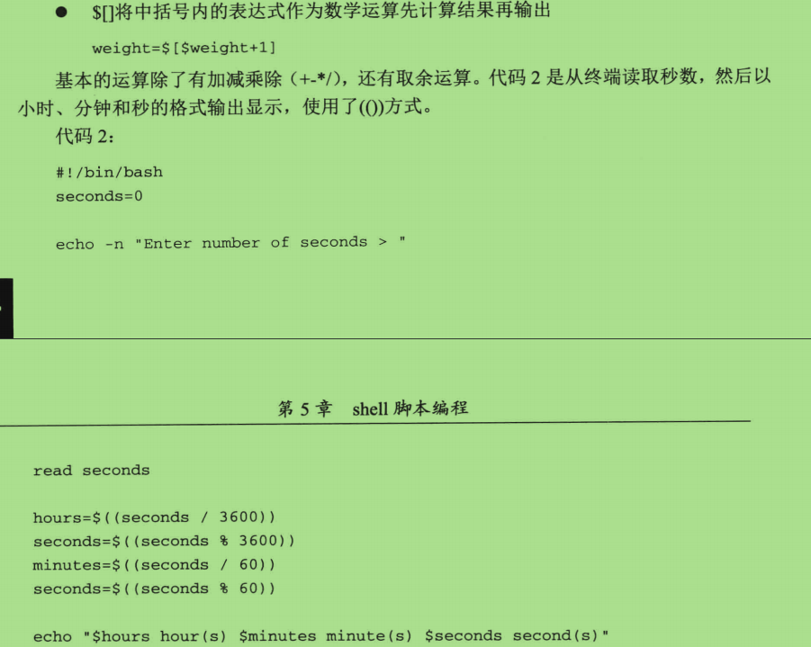

##5.2.3 流程控制##
>- <a href="http://www.runoob.com/linux/linux-shell-process-control.html" >Shell流程控制</a>

>- test语句 (这里特别提出)
    - test 语句 是做判断然后 返回 true/false
    - 例: 下面两种方式都是等效的， ；分号表示判断结束
        - 注意：如使用 [] 这种，一定需要在 \[ \] 里面加上两个空格
         
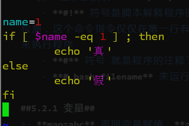
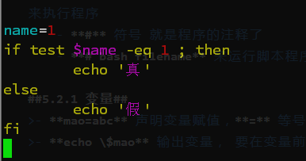
    - 例2：下图展示，-z 参数判断条件是否为空，与PHP empty() 等价
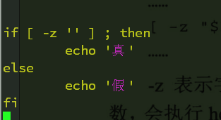
    - 下图展示出更多test语句可以检测的一些条件，使用# help test 查看列表
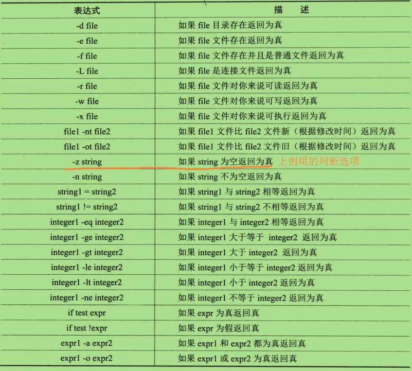

####5. 循环语句####
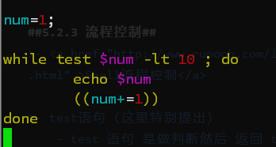
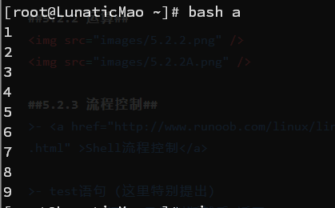

##5.2.4 自定义函数##
>- Shell 函数：<a href="http://blog.csdn.net/ljianhui/article/details/9333443">Shell 自定义函数 </a>

>- 传入文件名进函数，删除该文件

##5.3 输入和输出##
>- 本节将介绍标准输入、标准输出、文件描述符、重定向以及格式化输出

##5.4.5 "-x" 跟踪问题##

>- 在脚本出添加上 set -x  一行也可实现跟踪功能
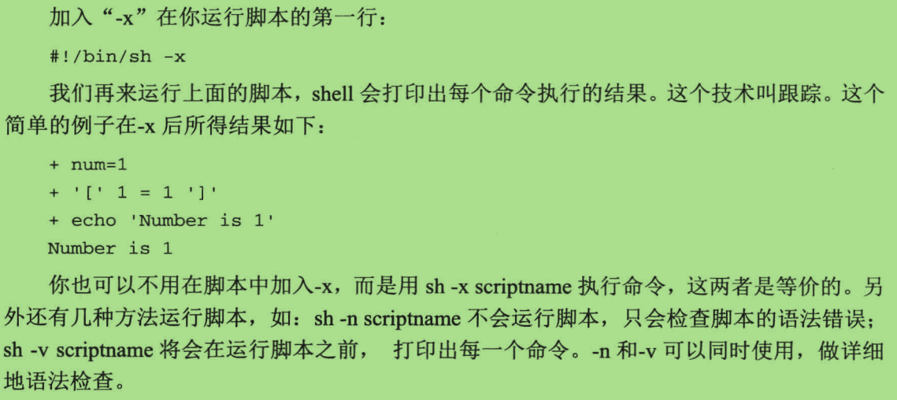
