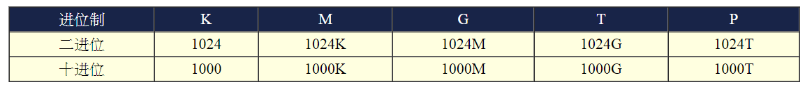
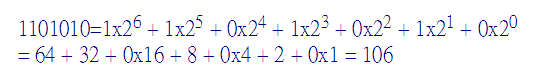
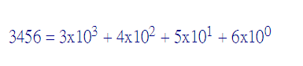
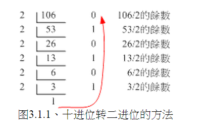
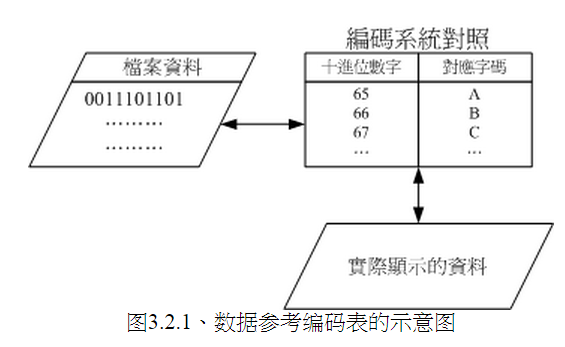

##第0章 计算器概论##

###目录：###

###1. 计算机：辅助人脑的好工具###

>- 由与 CPU 的工作主要在于管理 与 运算，因此在 CPU内又可分为两个主要的单元，分别是： 算数逻辑单元 与 控制单元。
    - 算数逻辑单元主要负责程序运算与逻辑判断
    - 控制单元则主要在协调各周边组件与各单元间工作。

 
####1.2 CPU的种类####

>- CPU其实内部已经含有一些小指令集，我们所使用的软件都要经过CPU内部的微指令集来达成才行。分为两种设计理念：
    - 精简指令集(RISC)
    - 复杂指令集(CISC)
    
 
####1.6 计算单位####

>- 容量单位
    - 
    - 档案容量使用的是二进位的方式，所以 1 GBytes的档案大小实际上为：1024x1024x1024 Bytes 这么大
    - 速度单位则常使用十进位，例如 1GHz 就是 1000x1000x1000 Hz 的意思。
    
 
###2.2 CPU : CPU 的外频与倍频、32位 与 64位、CPU等级###

>- 芯片组又分为两个桥接器来控制各组件的沟通:
    - 北桥：负责连结速度较快的CPU、主内存与显示卡等组件；
    - 南桥：负责连接速度较慢的周边介面，包括硬盘、USB、网络卡等等。

>- CPU 的频率：
    - 频率就是CPU每秒钟可以进行的工作次数，所以频率越高表示这颗CPU单位时间内可以作更多的事情
    - 举例来说，Intel的Core 2 Duo型号E8400的CPU频率为3.0GHz， 表示这颗CPU在一秒内可以进行3.0x10^9次工作（即：3 剩余 10 的 9 次方 == 3000000000 ）
    - 注意：不同的CPU之间不能单纯的以频率来判断运算效能，这是因为每颗CPU的微指令集不相同，架构也不见得一样，每次频率能够进行的工作指令数也不同之故！所以，频率目前仅能用来比较同款CPU的速度！
    
 
>- CPU 中的 [ 外频 ] 和 [ 倍频 ]
    - 各个组件都是透过北桥与南桥所连接在一起。 但就像一群人共同在处理一个连续作业一般，如果这一群人里面有个人的动作特别快或特别慢，将导致前面或者是后面的人事情一堆处理不完！也就是说，这一群人最好能够速度一致较佳！所以，CPU与外部各组件的速度理论上应该要一致才好。但是因为CPU需要较强大的运算能力，因为很多判断与数学都是在CPU内处理的，因此CPU开发商就在CPU内再加上一个加速功能，所以CPU有所谓的外频与倍频！
    -  
    - 外频：指的是CPU与外部组件进行数据传输时的速度
    - 倍频：则是 CPU 内部用来加速工作效能的一个倍数
    - [ 外频 ] 和 [ 倍频 ] 相乘才是CPU的频率速度
        - 我们以刚刚IntelCore2DuoE8400CPU来说，他的频率是3.0GHz，而外频是333MHz，因此倍频就是9倍罗！(3.0G=333Mx9, 其中1G=1000M)
        
 
>- 32位 与 64位
    - 通过前面知道，CPU运算的所有数据都是由 主内存提供的，主内存与CPU的沟通速度靠的就是**外部频率**
    - 那么每次工作可以传送的数据量有多大呢？那就是系统总线的功能。
        - 一般主机板芯片组有分 **北桥** 与 **南桥**
            - **北桥**：的系统总线称为系统系统总线，因为是内存传输的主要通道，所以速度较快。
            - **南桥**：就是所谓的输入输出(I/O)系统总线，主要在联系硬盘、USB、网络卡等周边设备。
    - 目前北桥所支持的频率可高达333/400/533/800/1066/1333/1600MHz等北桥所支持的频率我们称为前端系统总线速度(FrontSideBus,FSB)，而每次传送的位数则是系统总线宽度。那所谓的系统总线频宽则是：『FSBx系统总线宽度』亦即每秒钟可传送的最大数据量。目前常见的系统总线宽度有 **32/64位(bits)。**
    - CPU每次能够处理的数据量称为字长大小(word size)， 字长大小依据CPU的设计而有32位与64位。我们现在所称的计算机是32或64位主要是依据这个 CPU解析的字长大小而来的！早期的32位CPU中，因为CPU每次能够解析的数据量有限， 因此由主内存传来的数据量就有所限制了。**这也导致32位的CPU最多只能支持最大到4GBytes的内存**
    
 
>- CPU等级
    - 由於x86架构的CPU在Intel的Pentium系列(1993年)后就有不统一的脚位与设计，为了将不同种类的CPU规范等级，所以就有i386,i586,i686等名词出现了。基本上，在Intel Pentium MMX与AMD K6年代的CPU称为i586等级， 而Intel Celeron与AMD Athlon(K7)年代之后的32位CPU就称为i686等级。 至於目前的64位CPU则统称为x86_64等级。
    
 
####2.1 内存####

>- CPU所使用的数据都是来自于主内存
>- 个人计算机的主内存主要组件为动态随机访问内存(Dynamic Random Access Memory, DRAM)，随机访问内存只有在通电时才能记录与使用，断电后数据就消失了。
    - 网吧用的硬盘是通过硬件上的还原卡控制硬盘的初始化。
        
 
>- CPU频率与主内存的关系
    - CPU与主内存的外频应该要相同才好。不过，因为技术方面的提升，因此这两者的频率速度不会相同，但外频则应该是一致的较佳。举例来说，上面提到的Intel E8400 CPU外频为333MHz，则应该选用DDR II 667这个型号， 因为该内存型号的外频为333MHz之故喔！
    
 
>-  DRAM 与 SRAM
    - 除了主内存之外，事实上整部个人计算机当中还有许许多多的内存存在喔！最为我们所知的就是CPU内的第二层缓存内存。 我们现在知道CPU的数据都是由主内存提供，但主内存的数据毕竟得经由北桥送到CPU内。 如果某些很常用的程序或数据可以放置到CPU内部的话，那么CPU数据的读取就不需要透过北桥了！ 对於效能来说不就可以大大的提升了？这就是第二层缓存的设计概念。第二层缓存与主内存及CPU的关系如下图所示：

 
####2.4 硬盘与储存设备####

>- 当非正常关机时：由於硬盘内部机械手臂上的磁头与硬盘盘的接触是很细微的空间， 如果有抖动或者是脏污在磁头与硬盘盘之间就会造成数据的损毁或者是实体硬盘整个损毁～ 因此，正确的使用计算机的方式，应该是在计算机通电之后，就绝对不要移动主机，并免抖动到硬盘， 而导致整个硬盘数据发生问题啊！另外，也不要随便将插头拔掉就以为是顺利关机！因为机械手臂必须要归回原位， 所以使用操作系统的正常关机方式，才能够有比较好的硬盘保养啊！因为他会让硬盘的机械手臂归回原位啊！

 
####2.6 主机板####

>- 上面我们所谈到的所有芯片都是安插在主板上面的，而主机板上面的负责沟通各个组件的就是芯片组，芯片组分为**北桥**与**南桥**：
    - 北桥负责CPU/RAM/VGA等的连接
    - 南桥则负责PCI介面与速度较慢的I/O装置

 
>- 设备I/O位址与IRQ中断通道
    - 有输出/输入/不同的储存装置等等，主机板芯片组怎么知道如何负责沟通啊？这个时候就需要用到所谓的 **I/O位址与IRQ**
        - I/O位址：有点类似每个装置的门牌号码，每个装置都有他自己的位址，一般来说，不能有两个装置使用同一个I/O位址，否则系统就会不晓得该如何运作这两个装置了。
        - IRQ：可以想成是各个门牌连接到邮件中心(CPU)的专门路径，各装置可以透过IRQ中断通道来告知CPU该装置的工作情况，以方便CPU进行工作分配的任务
        
 
>- CMOS与BIOS
    - 前面内存的地方我们有提过CMOS与BIOS的功能，在这里我们再来强调一下： CMOS主要的功能为记录主机板上面的重要参数，包括系统时间、CPU电压与频率、各项设备的I/O位址与IRQ等，由於这些数据的记录要花费电力，因此主机板上面才有电池。 BIOS为写入到主机板上某一块 flash 或EEPROM 的程序，他可以在开机的时候执行，以载入CMOS当中的参数， 并尝试呼叫储存装置中的开机程序，进一步进入操作系统当中。BIOS程序也可以修改CMOS中的数据，

 
####3.1 数字系统####

>- 二进制：0/1的环境为二进位制，二进位，就是逢二就前进一位的意思。
    - 二进制位计算：
        - 
>- 十进制：指的是逢十进一位， 因此在个位数归为零而十位数写成1   
    - 十进制位计算：
        - 
>- 十进制 转为 二进制  ：
    - 例如十进制是：106，那么106除于2剩下53，53不是双数，所以要减去1，减去的1就是第一个二进制1，那么剩下52再除于2，可以整除，得到26,由于26是可以整除的，那么只要给二进制位0就是了，进行到当前的这一步，目前的二进制是 1 0 
    - 

 
####3.2 文字编码系统####

>- 既然计算机都只有记录0/1而已，甚至记录的数据都是使用byte/bit等单位来记录的，那么文字该如何记录啊？事实上文字档案也是被记录为0与1而已，而这个档案的内容要被取出来查阅时，必须要经过一个编码系统的处理才行。 所谓的『编码系统』可以想成是一个『字码对照表』，他的概念有点像底下的图示：

>- 例如：E 的 ascii 编码是 45, 把45这个十进制转换为二进制 ：101101 就是 E 的二进制格式
>- 所以如果出现了乱码的话，是因为编码对照表写错，导致对照的文字产生误差之故啦

 
####4.1 机器程序与编译程序####

>- 编译器：
    - 因为机器只看得懂机器代码 0 和 1，编译器把高级语言的代码转换为机器代码

 
####4.2 操作系统####

>- 操作系统核心(Kernel)
    - 操作系统(Operating System, OS)其实也是一组程序， 这组程序的重点在於管理计算机的所有活动以及驱动系统中的所有硬件。 
    - 我们刚刚谈到计算机没有软件只是一堆废铁，那么操作系统的功能就是让CPU可以开始判断逻辑与运算数值、 让主内存可以开始载入/读出数据与程序码、让硬盘可以开始被存取、让网络卡可以开始传输数据、 让所有周边可以开始运转等等。总之，硬件的所有动作都必须要透过这个操作系统来达成就是了。
    - 但是但有核心是不行的，因为核心主要在于管控硬件与提供相关的能力(例如网络功能)，这些管理的动作是非常的重要的，如果使用者能够直接使用到核心的话，万一使用者不小心将核心程序停止或破坏， 将会导致整个系统的崩溃！因此核心程序所放置到内存当中的区块是受保护的！ 并且开机后就一直常驻在内存当中。

 
>- 系统呼叫（System Call）
    - 既然硬件都是由核心管理，那么我要发软件的话，还有去参考这个核心的相关功能，很麻烦。
    - 为了解决这个问题，操作系统通常会提供一整组的开发介面给工程师来开发软件！ 工程师只要遵守该开发介面那就很容易开发软件了！举例来说，我们学习C程序语言只要参考C程序语言的函式即可， 不需要再去考量其他核心的相关功能，因为核心的系统呼叫介面会主动的将C程序语言的相关语法转成核心可以了解的任务函数， 那核心自然就能够顺利运作该程序了！

 
>- 核心功能
    - **系统呼叫介面(System call interface)**
        - 这是为了方便程序开发者可以轻易的透过与核心的沟通，将硬件的资源进一步的利用， 於是需要有这个简易的介面来方便程序开发者。
    - **程序管理(Process control)**
        - 总有听过所谓的『多工环境』吧？一部计算机可能同时间有很多的工作跑到CPU等待运算处理， 核心这个时候必须要能够控制这些工作，让CPU的资源作有效的分配才行！另外， 良好的CPU排程机制(就是CPU先运作那个工作的排列顺序)将会有效的加快整体系统效能呢
    - **内存管理(Memory management)**
        - 控制整个系统的内存管理，这个内存控制是非常重要的，因为系统所有的程序码与数据都必须要先存放在内存当中。 通常核心会提供虚拟内存的功能，当内存不足时可以提供内存置换(swap)的功能哩。
    - **档案系统管理(Filesystem management)**
        - 档案系统的管理，例如数据的输入输出(I/O)等等的工作啦！还有不同档案格式的支持啦等等，如果你的核心不认识某个档案系统，那么您将无法使用该档案格式的档案罗！
    - **装置的驱动(Device drivers)**
        - 就如同上面提到的，硬件的管理是核心的主要工作之一，当然罗，装置的驱动程序就是核心需要做的事情啦！ 好在目前都有所谓的『可载入模组』功能，可以将驱动程序编辑成模组，就不需要重新的编译核心啦！

 
###5. 重点回顾###
>- 计算机的定义为：『接受使用者输入指令与数据，经由中央处理器的数学与逻辑单元运算处理后，以产生或储存成有用的信息』；
>- 计算机的五大单元包括：输入单元、输出单元、CPU内部的控制单元、算数逻辑单元与主内存五大部分；
>- 数据会流进/流出内存是CPU所发布的控制命令，而CPU实际要处理的数据则完全来自於主内存；
>- CPU依设计理念主要分为：精简指令集(RISC)与复杂指令集(CISC)系统；
>- 关於CPU的频率部分：外频指的是CPU与外部组件进行数据传输时的速度，倍频则是CPU内部用来加速工作效能的一个倍数， 两者相乘才是CPU的频率速度；
>- 一般主机板芯片组有分北桥与南桥，北桥的系统总线称为系统系统总线，因为是内存传输的主要通道，所以速度较快。 南桥就是所谓的输入输出(I/O)系统总线，主要在联系硬盘、USB、网络卡等周边设备；
>- 北桥所支持的频率我们称为前端系统总线速度(Front Side Bus, FSB)，而每次传送的位数则是系统总线宽度。
>- CPU每次能够处理的数据量称为字长大小(word size)，字长大小依据CPU的设计而有32位与64位。 我们现在所称的计算机是32或64位主要是依据这个 CPU解析的字长大小而来的！
>- 个人计算机的主内存主要组件为动态随机访问内存(Dynamic Random Access Memory, DRAM)， 至於CPU内部的第二层缓存则使用静态随机访问内存(Static Random Access Memory, SRAM)；
>- BIOS(Basic Input Output System)是一套程序，这套程序是写死到主机板上面的一个内存芯片中， 这个内存芯片在没有通电时也能够将数据记录下来，那就是只读内存(Read Only Memory, ROM)；
>- 硬盘的组成为：圆形磁碟盘、机械手臂、 磁碟读取头与主轴马达所组成的，其中磁碟盘的组成为磁区、磁轨与磁柱；
>- 操作系统(Operating System, OS)其实也是一组程序， 这组程序的重点在於管理计算机的所有活动以及驱动系统中的所有硬件。
>- 计算机主要以二进位作为单位，常用的磁碟容量单位为bytes，其单位换算为1 Byte = 8bits。
>- 最阳春的操作系统仅在驱动与管理硬件，而要使用硬件时，就得需要透过应用软件或者是壳程序(shell)的功能， 来呼叫操作系统操纵硬件工作。目前称为操作系统的，除了上述功能外，通常已经包含了日常工作所需要的应用软件在内了

###6. 本章习题###

>- CPU的厂牌、型号、最高频率；
    - Inter \ i7 3630QM \ 2.4GHz
>- 主内存的容量、介面 (DDR/DDR II等)；
    - 4GB \ DDR3
>- 显示卡的介面 (AGP/PCIe/内建) 与容量    
    - 内建 \ 2GB
>- 主机板的厂牌、南北桥的芯片型号、BIOS的厂牌、有无内建的网卡或
音效卡等
    - INTEL \ Inter HM76 \ American Megatrends Inc. \ 有网卡
>- 硬盘的连接介面 (IDE/SATA等)、硬盘容量、转速、缓冲内存容量等。
    - SATA \ 500GB \  5400转 \ 8MB
