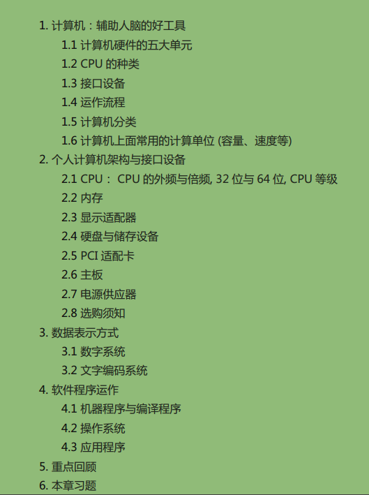

##第0章 计算器概论##

###目录：###

###1. 计算机：辅助人脑的好工具###

>- 由与 CPU 的工作主要在于管理 与 运算，因此在 CPU内又可分为两个主要的单元，分别是： 算数逻辑单元 与 控制单元。
    - 算数逻辑单元主要负责程序运算与逻辑判断
    - 控制单元则主要在协调各周边组件与各单元间工作。

 
####1.2 CPU的种类####

>- CPU其实内部已经含有一些小指令集，我们所使用的软件都要经过CPU内部的微指令集来达成才行。分为两种设计理念：
    - 精简指令集(RISC)
    - 复杂指令集(CISC)
    
 
####1.6 计算单位####

>- 容量单位
    - 
    - 档案容量使用的是二进位的方式，所以 1 GBytes的档案大小实际上为：1024x1024x1024 Bytes 这么大
    - 速度单位则常使用十进位，例如 1GHz 就是 1000x1000x1000 Hz 的意思。
    
 
###2.2 CPU : CPU 的外频与倍频、32位 与 64位、CPU等级###

>- 芯片组又分为两个桥接器来控制各组件的沟通:
    - 北桥：负责连结速度较快的CPU、主内存与显示卡等组件；
    - 南桥：负责连接速度较慢的周边介面，包括硬盘、USB、网络卡等等。

>- CPU 的频率：
    - 频率就是CPU每秒钟可以进行的工作次数，所以频率越高表示这颗CPU单位时间内可以作更多的事情
    - 举例来说，Intel的Core 2 Duo型号E8400的CPU频率为3.0GHz， 表示这颗CPU在一秒内可以进行3.0x10^9次工作（即：3 剩余 10 的 9 次方 == 3000000000 ）
    - 注意：不同的CPU之间不能单纯的以频率来判断运算效能，这是因为每颗CPU的微指令集不相同，架构也不见得一样，每次频率能够进行的工作指令数也不同之故！所以，频率目前仅能用来比较同款CPU的速度！
    
 
>- CPU 中的 [ 外频 ] 和 [ 倍频 ]
    - 各个组件都是透过北桥与南桥所连接在一起。 但就像一群人共同在处理一个连续作业一般，如果这一群人里面有个人的动作特别快或特别慢，将导致前面或者是后面的人事情一堆处理不完！也就是说，这一群人最好能够速度一致较佳！所以，CPU与外部各组件的速度理论上应该要一致才好。但是因为CPU需要较强大的运算能力，因为很多判断与数学都是在CPU内处理的，因此CPU开发商就在CPU内再加上一个加速功能，所以CPU有所谓的外频与倍频！
    -  
    - 外频：指的是CPU与外部组件进行数据传输时的速度
    - 倍频：则是 CPU 内部用来加速工作效能的一个倍数
    - [ 外频 ] 和 [ 倍频 ] 相乘才是CPU的频率速度
        - 我们以刚刚IntelCore2DuoE8400CPU来说，他的频率是3.0GHz，而外频是333MHz，因此倍频就是9倍罗！(3.0G=333Mx9, 其中1G=1000M)
        
 
>- 32位 与 64位
    - 通过前面知道，CPU运算的所有数据都是由 主内存提供的，主内存与CPU的沟通速度靠的就是**外部频率**
    - 那么每次工作可以传送的数据量有多大呢？那就是系统总线的功能。
        - 一般主机板芯片组有分 **北桥** 与 **南桥**
            - **北桥**：的系统总线称为系统系统总线，因为是内存传输的主要通道，所以速度较快。
            - **南桥**：就是所谓的输入输出(I/O)系统总线，主要在联系硬盘、USB、网络卡等周边设备。
    - 目前北桥所支持的频率可高达333/400/533/800/1066/1333/1600MHz等北桥所支持的频率我们称为前端系统总线速度(FrontSideBus,FSB)，而每次传送的位数则是系统总线宽度。那所谓的系统总线频宽则是：『FSBx系统总线宽度』亦即每秒钟可传送的最大数据量。目前常见的系统总线宽度有 **32/64位(bits)。**
    - CPU每次能够处理的数据量称为字长大小(word size)， 字长大小依据CPU的设计而有32位与64位。我们现在所称的计算机是32或64位主要是依据这个 CPU解析的字长大小而来的！早期的32位CPU中，因为CPU每次能够解析的数据量有限， 因此由主内存传来的数据量就有所限制了。**这也导致32位的CPU最多只能支持最大到4GBytes的内存**
    
 
>- CPU等级
    - 由於x86架构的CPU在Intel的Pentium系列(1993年)后就有不统一的脚位与设计，为了将不同种类的CPU规范等级，所以就有i386,i586,i686等名词出现了。基本上，在Intel Pentium MMX与AMD K6年代的CPU称为i586等级， 而Intel Celeron与AMD Athlon(K7)年代之后的32位CPU就称为i686等级。 至於目前的64位CPU则统称为x86_64等级。
    
 
####2.1 内存####

>- CPU所使用的数据都是来自于主内存
>- 个人计算机的主内存主要组件为动态随机访问内存(Dynamic Random Access Memory, DRAM)，随机访问内存只有在通电时才能记录与使用，断电后数据就消失了。
    - 网吧用的硬盘是通过硬件上的还原卡控制硬盘的初始化。
        
 
>- CPU频率与主内存的关系
    - CPU与主内存的外频应该要相同才好。不过，因为技术方面的提升，因此这两者的频率速度不会相同，但外频则应该是一致的较佳。举例来说，上面提到的Intel E8400 CPU外频为333MHz，则应该选用DDR II 667这个型号， 因为该内存型号的外频为333MHz之故喔！
    
 
>-  DRAM 与 SRAM
    - 除了主内存之外，事实上整部个人计算机当中还有许许多多的内存存在喔！最为我们所知的就是CPU内的第二层缓存内存。 我们现在知道CPU的数据都是由主内存提供，但主内存的数据毕竟得经由北桥送到CPU内。 如果某些很常用的程序或数据可以放置到CPU内部的话，那么CPU数据的读取就不需要透过北桥了！ 对於效能来说不就可以大大的提升了？这就是第二层缓存的设计概念。第二层缓存与主内存及CPU的关系如下图所示：

 
####2.4 硬盘与储存设备####

>- 当非正常关机时：由於硬盘内部机械手臂上的磁头与硬盘盘的接触是很细微的空间， 如果有抖动或者是脏污在磁头与硬盘盘之间就会造成数据的损毁或者是实体硬盘整个损毁～ 因此，正确的使用计算机的方式，应该是在计算机通电之后，就绝对不要移动主机，并免抖动到硬盘， 而导致整个硬盘数据发生问题啊！另外，也不要随便将插头拔掉就以为是顺利关机！因为机械手臂必须要归回原位， 所以使用操作系统的正常关机方式，才能够有比较好的硬盘保养啊！因为他会让硬盘的机械手臂归回原位啊！

 
####2.6 主机板####

>- 上面我们所谈到的所有芯片都是安插在主板上面的，而主机板上面的负责沟通各个组件的就是芯片组，芯片组分为**北桥**与**南桥**：
    - 北桥负责CPU/RAM/VGA等的连接
    - 南桥则负责PCI介面与速度较慢的I/O装置

 
>- 设备I/O位址与IRQ中断通道
    - 有输出/输入/不同的储存装置等等，主机板芯片组怎么知道如何负责沟通啊？这个时候就需要用到所谓的 **I/O位址与IRQ**
        - I/O位址：有点类似每个装置的门牌号码，每个装置都有他自己的位址，一般来说，不能有两个装置使用同一个I/O位址，否则系统就会不晓得该如何运作这两个装置了。
        - IRQ：可以想成是各个门牌连接到邮件中心(CPU)的专门路径，各装置可以透过IRQ中断通道来告知CPU该装置的工作情况，以方便CPU进行工作分配的任务
        
 
>- CMOS与BIOS
    - 前面内存的地方我们有提过CMOS与BIOS的功能，在这里我们再来强调一下： CMOS主要的功能为记录主机板上面的重要参数，包括系统时间、CPU电压与频率、各项设备的I/O位址与IRQ等，由於这些数据的记录要花费电力，因此主机板上面才有电池。 BIOS为写入到主机板上某一块 flash 或EEPROM 的程序，他可以在开机的时候执行，以载入CMOS当中的参数， 并尝试呼叫储存装置中的开机程序，进一步进入操作系统当中。BIOS程序也可以修改CMOS中的数据，
