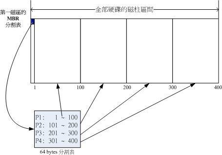

##第3章： 主机规划和磁盘分区##

###2. 磁盘分区###

>- 分割槽(partition)：你可能会有一颗磁碟并且将他分割成为C:, D:, E:槽对吧

 
####2.1 磁盘连接的方式与装置档名的关系####
>- 磁盘分为：IDE / SATA
    - IDE :  IDE的一个排线可以接入两个 IDE 设备，这两个IDE介面通常被称为IDE1(primary)及IDE2(secondary)，每条排线上面的IDE装置可以被区分为Master与Slave。
    - SATA : 由於SATA/U盘/SCSI等磁碟介面都是使用SCSI模块来驱动的， 因此这些介面的磁碟装置档名都是/dev/sd[a-p]的格式 例如：主板上有6个SATA接口,
    	- SATA1插槽上的档名：/dev/sda
		- SATA5插槽上的档名：/dev/sdb
		- U盘磁碟(启动完成后才被系统捉到)：/dev/sdc

 
####2.2 磁碟的组成复习####
>- 硬盘的组成:
	- 磁碟盘 、 机械手臂、磁碟读取头、主轴马达
	- 而数据的写入其实是在磁碟盘上面
>- 硬盘单位：磁碟盘上面又可细分出磁区(Sector)与磁柱(Cylinder)两种单位， 其中磁区每个为512bytes那么大。假设磁碟只有一个磁碟盘，那么磁碟盘有点像底下这样：

 
>- 硬盘中的第一个磁区（主要记录了两个重要的资讯）：
	- 主要启动记录区(Master Boot Record, MBR)：可以安装启动管理程序的地方，有446 bytes
		- MBR 很重要因为当系统在启动的时候会主动去读取这个区块的内容，这样系统才会知道你的程序放在哪里且该如何进行启动。
	- 分割表(partition table)：记录整颗硬盘分割的状态，有64 bytes
		- PT: 记录了分区信息，硬盘被切割分区

 
####2.3 磁盘分区表(partition table)####

>- 利用参考对照磁柱号码的方式来处理啦！ 在分割表所在的64 bytes容量中，总共分为四组记录区，每组记录区记录了该区段的启始与结束的磁柱号码。 若将硬盘以长条形来看，然后将磁柱以直条图来看，那么那64 bytes的记录区段有点像底下的图示：

 
####硬盘分区小结：####
>- 硬盘默认的分割表仅能写入四组分割资讯
>- 其实所谓的『分割』只是针对那个64 bytes的分割表进行配置而已！
>- 这四组分割资讯我们称为主要(Primary)或延伸(Extended)分割槽
>- 分割槽的最小单位为磁柱(cylinder)
>- 当系统要写入磁碟时，一定会参考磁盘分区表，才能针对某个分割槽进行数据的处理

 
####主要分割、扩展分配与逻辑分割的特性小结：####
>- 主要分割与扩展分配最多可以有四笔(硬盘的限制)
>- 扩展分配最多只能有一个(操作系统的限制)
>- 逻辑分割是由扩展分配持续切割出来的分割槽；
>- 能够被格式化后，作为数据存取的分割槽为主要分割与逻辑分割。扩展分配无法格式化；
>- 逻辑分割的数量依操作系统而不同，在Linux系统中，IDE硬盘最多有59个逻辑分割(5号到63号)， SATA硬盘则有11个逻辑分割(5号到15号)。

####文件系统与目录树的关系(挂载)####

>- 我们知道数据是存放在硬盘的区槽内的。
>- 但Linux的文件结构又是目录树的结构
>- 现在的问题是『如何结合目录树的架构与磁碟内的数据』呢？ 这个时候就牵扯到『挂载(mount)』的问题

 
>- 所谓的『挂载』就是利用一个目录当成进入点，将磁盘分区槽的数据放置在该目录下； 也就是说，进入该目录就可以读取该分割槽的意思。这个动作我们称为『挂载』，那个进入点的目录我们称为『挂载点』。 由於整个Linux系统最重要的是根目录，因此根目录一定需要挂载到某个分割槽的。 至於其他的目录则可依使用者自己的需求来给予挂载到不同的分割槽。我们以下图来作为一个说明：

>- 上图中假设我的硬盘分为两槽，partition 1是挂载到根目录，至於partition 2则是挂载到/home这个目录。 这也就是说，当我的数据放置在/home内的各次目录时，数据是放置到partition 2的，如果不是放在/home底下的目录， 那么数据就会被放置到partition 1了！

 
####3.6大硬盘配合旧主机造成的无法启动问题####

>- 随著时代的演变，在2009年中的目前，个人计算机上面的硬盘容量竟然都已经高达750 GB以上了！ 这么大的硬盘用起来当然是很爽快的啦～不过，也有一些问题的～那就是～启动的问题～

 
>- 某些比较旧的主板中，他们的BIOS可能找不到比较大容量的磁碟的。所以，你在旧主板上面安装新的大容量磁碟时， 很可能你的磁碟容量会被误判！不过，即使是这样，Linux还是能够安装喔！而且能够顺利的捉到完整的硬盘容量呢！ 为什么呢？因为当Linux核心顺利启动启动后，他会重新再去侦测一次整个硬件而不理会BIOS所提供的资讯， 所以就能够顺利的捉到正确的硬盘，并且让你安装Linux。
但是，安装完毕后，可能会无法启动喔！为什么啊？前一小节里面我们不是谈到过启动流程与MBR的内容吗？ 安装的时候是以光盘启动并且由光盘加载Linux核心，所以核心可以被顺利加载来安装。但是若以这样的配备来启动时， 因为BIOS捉到的硬盘是不对的，所以使用硬盘启动可能就会出现无法启动的错误了。那怎办？
由於BIOS捉到的磁碟容量不对，但是至少在整颗磁碟前面的磁区他还读的到啊！ 因此，你只要将这个磁碟最前面的容量分割出一个小分割槽，并将这个分割槽与系统启动文件的放置目录摆在一起， 那就是 /boot 这个目录！就能够解决了！很简单吧！ 其实，重点是：『将启动磁区所在分割槽规范在小於1024个磁柱以内～』 即可！那怎么做到呢？很简单，在进行安装的时候，规划出三个磁区，分别是：
/boot
/
swap
那个/boot只要给100M Bytes左右即可！而且/boot要放在整块硬盘的最前面！这部份你先有印象与概念即可，未来我们谈到第二十章的启动流程时，会再加强说明的！ ^_^

 
####重点回顾####

>- 新添购计算机硬件配备时，需要考量的角度有『游戏机/工作机的考量』、『效能/价格比的考量』、『支持度的考量』等
>- 旧的硬件配备可能由於保存的问题或者是电子零件老化的问题， 导致计算机系统非常容易在运行过程中出现不明的死机情况
>- 在Linux系统中，每个装置都被当成一个文件来对待，每个装置都会有装置档名。
>- 磁碟的装置档名主要分为 (1)IDE介面的/dev/hd[a-d]及 (2)SATA/SCSI/U盘介面的/dev/sd[a-p]两种；
>- 磁碟的第一个磁区主要记录了两个重要的资讯，分别是： (1)主要启动记录区(Master Boot Record, MBR)：可以安装启动管理程序的地方，有446 bytes (1)分割表(partition table)：记录整颗硬盘分割的状态，有64 bytes；
>- 磁碟的主要与扩展分配最多可以有四个，逻辑分割的装置档名号码，一定由5号开始；
启动的流程由：BIOS-->MBR-->-->boot loader-->核心文件；
>- boot loader的功能主要有：提供菜单、加载核心、转交控制权给其他loader
>- boot loader可以安装的地点有两个，分别是 MBR 与 boot sector
>- Linux操作系统的文件使用目录树系统，与磁碟的对应需要有『挂载』的动作才行；
>- 新手的简单分割，建议只要有/及swap两个分割槽即可

 
####本章习题#### 

>- 请分析你的家用计算机，以你的硬件配备来计算可能产生的耗电量，最终再以计算出来的总瓦数乘上你可能启动的时间， 以推估出一年你可能会花费多少钱在你的这部主机上面？
    - 437.76 
>- 一部计算机主机是否只要 CPU 够快，整体速度就会提高？
    - 不是的，一台计算机是一个整体
>- Linux 对於硬件的要求需要的考虑为何？是否一定要很高的配备才能安装 Linux ？
    - 不是的，主要看你用Linux来做什么事情
>- 一部好的主机在安装之前，最好先进行规划，哪些是必定需要注意的 Linux 主机规划事项？
    -  构想主要用途 来 分割硬盘，给需要的分区挂载
>- 请写下下列配备中，在 Linux 的装置档名   
    - IDE 硬盘： /dev/hd[a-d]
    - CDROM： /dev/cdrom
    - 打印机：/dev/lp[0-2]
    - 软盘机： /dev/fd[0-1]
    - 网络卡：/dev/eth[0-n]
>- 如果您的系统常常死机，又找不到方法解决，您可以朝硬件的那个方向去搜寻？
    - CPU是否发热严重、硬件是否不兼容
    - 是否插了不同厂商的内存
>- 目前在个人计算机上面常见的硬盘与主板的连接介面有哪两个？
    - 早期:IDE 
    - 现在：SATA 、SCSI
