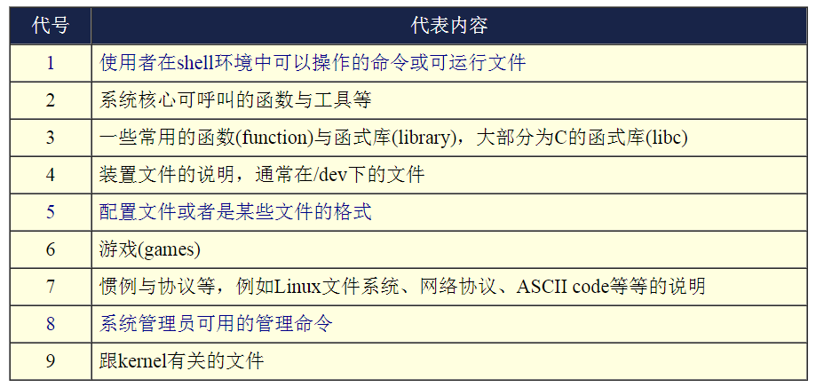
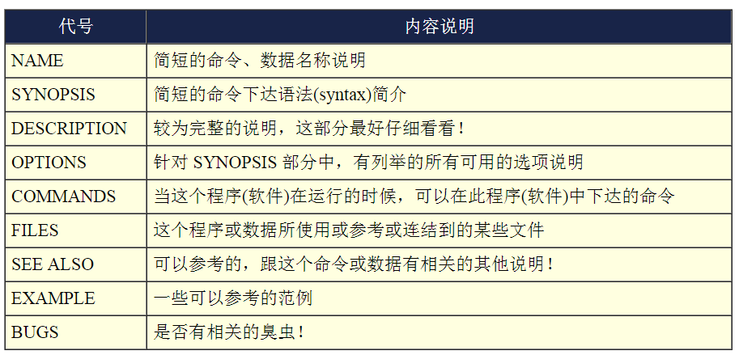

##第五章、首次登陆与在线求助 man page##

###2.1 基础命令的操作###

>- 显示日期与时间的命令： date
>- 显示日历的命令： cal
>- 简单好用的计算器： bc

 
>- 从上面的可以得知输入命令的时候出现两种情况:
    - 一种是该命令会直接显示结果然后回到命令提示字符等待下一个命令的输入；
    - 一种是进入到该命令的环境，直到结束该命令才回到命令提示字符的环境。
    

###2.3 重要的几个热键[Tab], [ctrl]-c, [ctrl]-d###

>- [Tab]按键
>- [Ctrl]-c 按键
>- [Ctrl]-d 按键

 

###3.1 man page###

>- 输入 # man date 命令，显示的第一行，出现了 [ DATE（1） ] 的东西
    - DATE 我们知道是日期，但 （1） 是什么，其实那是**命令的代号**
    - DATE (1) 代表：DATE 是 ：使用者在shell环境中可以操作的命令或可运行文件
    
>- 命令的代号：

 
>- man pages 的大概内容项

 
>- man pages 的操作：
    - 方向键上下控制 或 空格
    -  /search  在 man pages 内搜索功能
    
 
###总结上面的三个咚咚(man, info, /usr/share/doc/)，请记住喔：###
>- 在文字接口下，有任何你不知道的命令或文件格式这种玩意儿，但是你想要了解他，请赶快使用man或者是info来查询！
>- 而如果你想要架设一些其他的服务，或想要利用一整组软件来达成某项功能时，请赶快到/usr/share/doc 底下查一查有没有该服务的说明档喔！        

 
###6. 启动过程的问题排解###

>- 因为某些原因导致硬盘中的某个分区损毁，解决的方法其实很简单，不过因为出错扇区所挂载的目录不同，处理的流程困难度就有差异了。 举例来说，如果你的根目录『/』并没有损毁，那就很容易解决，如果根目录已经损毁了，那就比较麻烦！

 
>- 如果根目录没有损毁:
    - 假设你发生错误的partition是在/dev/sda7这一块，那么在启动的时候，屏幕应该会告诉你：press root password or ctrl+D : 这时候请输入root的密码登陆系统，然后进行如下动作：
        - 在光标处输入root密码登陆系统，进行单人单机的维护工作；
        - 输入『 fsck /dev/sda7 』(fsck 为文件系统检查的命令，/dev/sda7为错误的partition，请依你的情况下达参数)， 这时屏幕会显示开始修理硬盘的信息，如果有发现任何的错误时，屏幕会显示： clear [Y/N]？ 的询问信息，就直接输入 Y 吧！
        
 
>- 如果根目录损毁了
    - 一般初学者喜欢将自己的硬盘只划分为一个大partition，亦即只有根目录， 那文件系统错误一定是根目录的问题啰！这时你可以将硬盘拔掉，接到另一台Linux系统的计算机上， 并且不要挂载(mount)该硬盘，然后以root的身份运行『 fsck /dev/sdb1 』(/dev/sdb1 指的是你的硬盘装置文件名，你要依你的实际状况来配置)，这样就 OK 啰！
    - 另外，也可以使用近年来很热门的Live CD，也就是利用光盘启动就能够进入Linux操作系统的特性， 你可以前往：『http://knoppix.tnc.edu.tw/』 这个网站来下载，并且刻录成为CD，这个时候先用Live CD光盘启动，然后使用fsck去修复原本的根目录， 例如： fsck /dev/sda1 ，就能够救回来了！

###重点回顾###

>- 为了避免瞬间断电造成的Linux系统危害，建议做为服务器的Linux主机应该加上不断电系统来持续提供稳定的电力；

>- 默认的图形模式登陆中，可以选择语系以及作业阶段。作业阶段为多种窗口管理员软件所提供，如GNOME及KDE等；
>- CentOS 5.x默认的中文输入法为使用SCIM这个软件所提供的输入；
>- 不论是KDE还是GNOME默认都提供四个Virtual Desktop给使用者使用；
>- 在X的环境下想要重新启动X的组合按键为：『[alt]+[ctrl]+[backspace]』；
>- 默认情况下，Linux提供tty1~tty6的文字接口登陆，以及tty7的图形接口登陆环境；
>- 除了run level 5默认取得图形接口之外，run level 3亦可使用 startx 进入图形环境；
>- 在终端机环境中，可依据提示字符为$或#判断为一般账号或root账号；
>- date可显示日期、cal可显示日历、bc可以做为计算器软件；
>- 组合按键中，[tab]按键可做为命令补齐或档名补齐，[crtl]-[c]可以中断目前正在运行中的程序；
>- 联机帮助系统有man及info两个常见的命令；
>- man page说明后面的数字中，1代表一般账号可用命令，8代表系统管理员常用命令，5代表系统配置文件格式
>- info page可将一份说明文件拆成多个节点(node)显示，并具有类似超链接的功能，添加易读性；
>- 系统需正确的关机不容易损坏，可使用shutdown,poweroff等命令关机。

###本章习题###

>- 请问如果我以文本模式登陆Linux主机时，我有几个终端机接口可以使用？如何切换各个不同的终端机接口？
    - 共有六个， tty1 ~ tty6 ，切换的方式为 Crtl + Alt + [F1]~[F6]，其中， [F7] 为图形接口的使用。
>- 在Linux系统中，/VBird与/vbird是否为相同的文件？
    - 不同
>- 我想要知道 date 如何使用，应该如何查询？
    - man date
>- 我想要在今天的 1:30 让系统自己关机，要怎么做？
    - shutdown -h 1:30
>- 我想要知道 2010 年 5 月 2 日是星期几？该怎么做？
    - 最简单的方式直接使用 cal 5 2010 即可找出 2010 年 5 月份的月历。
>- 使用 man date 然后找出显示目前的日期与时间的参数，成为类似：2009/10/16-20:03
>- 使用 man date 然后找出显示目前的日期与时间的参数，成为类似：2009/10/16-20:03
    - # date +%Y/%m/%d-%H:%M
    
>- 简单说明在 bash shell 的环境下， [tab] 按键的用途？
    - 补齐命令 和 补齐文件名
>- 如何强制中断一个程序的进行？(利用按键，非利用 kill 命令)
    - Ctrl + C
>- Linux 提供相当多的在线查询，称为 man page，请问，我如何知道系统上有多少关于 passwd 的说明？又，可以使用其他的程序来取代 man 的这个功能吗？
    - man passwd
    - info passwd
>- man -k passwd 与 man -K passwd 有什么差异(大小写的 K )？
    - 小写的 -k 为查询关键词，至于 -K 则是整个系统的 man page 查询～ 每个被检查到有关键词的 man page file 都会被询问是否要显示， 你可以输入『ynq』，来表示：y:要显示到屏幕上；n:不显示；q:结束 man 的查询。
>- man page 显示的内容的文件是放置在哪些目录中？
    - 放置在 /usr/share/man/ 与 /usr/local/man 等默认目录中。
>- Linux 提供一些在线文献数据，这些数据通常放在那个目录当中
    - 通常放在 /usr/share/doc 当中！
