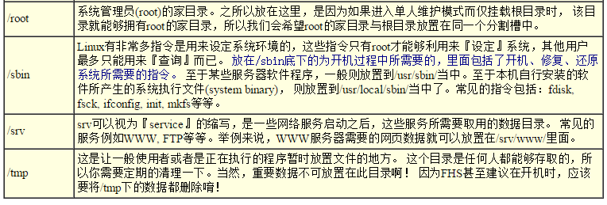

##第六章 Linux 的文件权限与目录配置##

 
###2.3 目录与文件之权限意义###

>- 文件权限的意义：
    - r (read)：可读取此一文件的实际内容，如读取文本文件的文字内容
    - w (write)：可以编辑、新增或是修改该文件的内容(但不含删除该文件)
    - x (execute)：该文件具有可以被系统执行的权限。
    
 
>- 目录权限的意义：
    - **r (read contents in directory)**：
        - 表示具有读取目录结构列表的权限，所以当你具有读取(r)一个目录的权限时，表示你可以查询该目录下的文件名数据。 所以你就可以利用 ls 这个指令将该目录的内容列表显示出来！
    - **w (modify contents of directory)**：
        - 表示你具有异动该目录结构列表的权限
            - 建立新的文件与目录；
            - 删除已经存在的文件与目录(不论该文件的权限为何！)
            - 将已存在的文件或目录进行更名；
            - 搬移该目录内的文件、目录位置。
    - **x (access directory)**：
        - 目录的x代表的是用户能否进入该目录成为工作目录的用途
        
 
>- 当一个目录的拥有者是 [ Lunaitc ] , 然后这个目录对拥有者权限又是 rwx ，那么他可以随意读取或删除 这个目录下的 文件 ， 即使这些文件的权限为：000 。
    - 目录有 r 权限：有这个权限的用户可以：读取目录的文件名列表，但无法读取详细的信息，只能读取到文件的名字
    
    - 目录有 x 权限：『能否进入该目录』有关
    - 目录有 w 权限：他可以让使用者删除、更新、新建文件或目录
    zh_CN.UTF-8
    
 
###3.1 Linux目录配置的依据--FHS：/, /usr, /var###

>- 市场上有很多 Linux distributions ，但他们的 配置文件啊、执行文件啊、每个目录内放置的东西，大多都一样，这是因为，Filesystem Hierarchy Standard (FHS)标准。
>- 根据FHS(http://www.pathname.com/fhs/)的官方文件指出， 他们的主要目的是希望让使用者可以了解到已安装软件通常放置于那个目录下， 所以他们希望独立的软件开发商、操作系统制作者、以及想要维护系统的用户，都能够遵循FHS的标准。 也就是说，FHS的重点在于规范每个特定的目录下应该要放置什么样子的数据而已。

 
>- FHS依据文件系统使用的频繁与否与是否允许使用者随意更动， 而将目录定义成为四种交互作用的形态

>- 什么是那四个类型？
    - **可分享的**：可以分享给其他系统挂载使用的目录，所以包括执行文件与用户的邮件等数据， 是能够分享给网络上其他主机挂载用的目录；
    - **不可分享的**：自己机器上面运作的装置文件或者是与程序有关的socket文件等， 由于仅与自身机器有关，所以当然就不适合分享给其他主机了。
    - **不变的**：有些数据是不会经常变动的，跟随着distribution而不变动。 例如函式库、文件说明文件、系统管理员所管理的主机服务配置文件等等；
    - **可变动的**：经常改变的数据，例如登录文件、一般用户可自行收受的新闻组等。
    
 
>- 实上，FHS针对目录树架构仅定义出三层目录底下应该放置什么数据而已，分别是底下这三个目录的定义：
    - **/ (root, 根目录)：与开机系统有关；**
    - **/usr (unix software resource)：与软件安装/执行有关；**
    - **/var (variable)：与系统运作过程有关；**
    
 
>- **根目录 (/) 的意义与内容：**
    - 根目录也与开机/还原/系统修复等动作有关
    - HFS希望根目录不要放在非常大的分割槽内， 因为越大的分割槽妳会放入越多的数据，如此一来根目录所在分割槽就可能会有较多发生错误的机会。
    - 因此FHS定义出根目录(/)底下应该要有底下这些次目录的存在才好：
    
    
    
    
 
>- 因为根目录与开机有关，开机过程中仅有根目录会被挂载，其他分割槽则是在开机完成之后才会持续的进行挂载的行为。因此根目录下与开机过程有关的目录， 就不能够与根目录放到不同的分割槽去！那哪些目录**不可与根目录分开呢？** 这五个目录千万不可与根目录分开在不同的分割槽！
    - /etc：配置文件
    - /etc：配置文件
    - /dev：所需要的装置文件
    - /lib：执行档所需的函式库与核心所需的模块
    - /sbin：重要的系统执行文件 
    
 

###重点回顾###

>- Linux的每个文件中，依据权限分为使用者、群组与其他人三种身份；    
>- 群组最有用的功能之一，就是当你在团队开发资源的时候，且每个账号都可以有多个群组的支持；
>- 利用ls -l显示的文件属性中，第一个字段是文件的权限，共有十个位，第一个位是文件类型， 接下来三个为一组共三组，为使用者、群组、其他人的权限，权限有r,w,x三种；
>- 如果档名之前多一个『 . 』，则代表这个文件为『隐藏档』；
>- 更改文件的群组支持可用chgrp，修改文件的拥有者可用chown，修改文件的权限可用chmod
>- chmod修改权限的方法有两种，分别是符号法与数字法，数字法中r,w,x分数为4,2,1；
>- **对文件来讲，权限的效能为**：
    - r：可读取此一文件的实际内容，如读取文本文件的文字内容等；
    - w：可以编辑、新增或者是修改该文件的内容(但不含删除该文件)；
    - x：该文件具有可以被系统执行的权限。
>- 要开放目录给任何人浏览时，应该至少也要给予r及x的权限，但w权限不可随便给；
>- Linux档名的限制为：单一文件或目录的最大容许文件名为 255 个字符；包含完整路径名称及目录 (/) 之完整档名为 4096 个字符
>- FHS订定出来的四种目录特色为：shareable, unshareable, static, variable等四类；
>- FHS所定义的三层主目录为：/, /var, /usr三层而已；
>- 有五个目录不可与根目录放在不同的partition，分别为/etc, /bin, /lib, /dev, /sbin五个

 
###本章练习###

>- 请说明/bin与/usr/bin目录所放置的执行文件有何不同之处？
    - /bin 目录所放的内容大都与 root 命令 有关
    - /usr/bin 目录所放的内容大都与 用户 命令 有关
>- 请说明/bin与/sbin目录所放置的执行文件有何不同之处？
    - /bin 目录所放的内容大都与 root 命令 有关
    - /sbin 目录所放的内容大都是非系统正常运作所需要的系统指令
>- 哪几个目录不能够与根目录(/)放置到不同的partition中？并请说明该目录所放置的数据为何？
    - /etc：配置文件
    - /bin：重要执行档
    - /dev：所需要的装置文件
    - /lib：执行档所需的函式库与核心所需的模块
    - /sbin：重要的系统执行文件
>- 试说明为何根目录要小一点比较好？另外在分割时，为什么/home, /usr, /var,]
/tmp最好与根目录放到不同的分割槽？ 试说明可能的原因为何(由目录放置数据的内容谈起)？
    - 因为 根目录 不要放其它的应用程序的数据，如此不但效能较佳，根目录所在的文件系统也较不容易发生问题。
    - /home, /usr, /var,/tmp 因为这几个文件都是服务器运行后，会有数据进入的目录，发生磁盘损坏的几率也比其它目录要大，如果把他们进行分区就算其中某一个目录发生损坏，也不会影响到其它分区的数据
>- 早期的 Unix 系统文件名最多允许 14 个字符，而新的 Unix 与 Linux 系统中，文件名最多可以容许几个字符？
    - 由于使用Ext2/Ext3文件系统，单一档名可达 255 字符，完整文件名 (包含路径) 可达 4096 个字符
>- 当一个一般文件权限为 -rwxrwxrwx 则表示这个文件的意义为？
    - 拥有者、拥有组、其他人 都有对这个文件 rwx 的权限
>- 我需要将一个文件的权限改为 -rwxr-xr-- 请问该如何下达指令？
    - # chmod 753 xxx
>- 若我需要更改一个文件的拥有者与群组，该用什么指令？
    - # chown root:root xxxx
>- Linux 传统的文件系统为何？此外，常用的 Journaling 文件格式有哪些？
    - 传统文件格式为：ext2,
Journaling 有 ext3 及 Reiserfs 等
>- 请问底下的目录与主要放置什么数据：
/etc/, /etc/init.d, /boot, /usr/bin, /bin, /usr/sbin, /sbin, /dev, /var/log
    - /etc/：几乎系统的所有配置文件案均在此，尤其 passwd,shadow
    - /etc/init.d：系统开机的时候加载服务的 scripts 的摆放地点
    - /usr/bin, /bin：一般执行档摆放的地方
    - /boot：开机配置文件，也是预设摆放核心 vmlinuz 的地方
    - /dev：摆放所有系统装置文件的目录
    - /usr/sbin, /sbin：系统管理员常用指令集
    - /var/log：摆放系统注册表文件的地方
>- 若一个文件的档名开头为『 . 』，例如 .bashrc 这个文件，代表什么？另外，如何显示出这个文件名与他的相关属性？
    - .  代表隐藏文件
    - ls -a 
    
